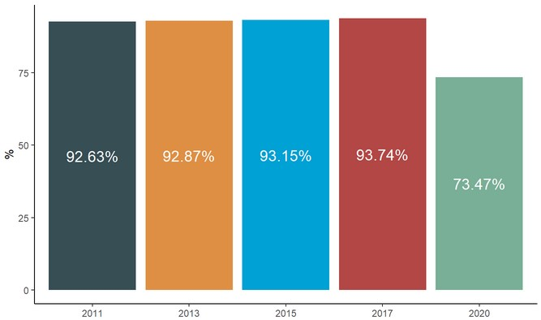

```{r setup, include=FALSE}
knitr::opts_chunk$set(echo = TRUE, message = F, warning = F, results = 'asis')
summarytools::st_options(bootstrap.css     = FALSE, 
           plain.ascii       = FALSE,      
           style             = "rmarkdown", 
           dfSummary.silent  = TRUE,        
           footnote          = NA,         
           subtitle.emphasis = FALSE)
library(ggplot2); theme_set(theme_classic() + theme(text = element_text(size = 12)))
library(knitr);  options(knitr.kable.NA = '')
```
```{r packages, echo = F}
# 1. Cargar paquetes
pacman::p_load(sjmisc, tidyverse, ggplot2, ggsci, googlesheets4, magrittr, kableExtra, ggpubr, chilemapas)
```
```{r load, echo = F}
#2. Cargar base de datos 
mv <- readRDS("movid.rds")
movid <- mv
mv <- mv %>% group_by(pob_id) %>% filter(semana == max(semana)) %>% ungroup(pob_id)
```

# Contexto

Hasta el día 2 de Octubre, la pandemia COVID-19 en Chile ha producido 464.750 personas contagiadas y 12.822 personas fallecidas [(MINSAL, 2020)](https://www.minsal.cl/nuevo-coronavirus-2019-ncov/casos-confirmados-en-chile-covid-19/). Estudios internacionales han relevado el impacto de la pandemia en el acceso a servicios de salud [(Baum, Schwartz., 2020;](https://www.ncbi.nlm.nih.gov/pmc/articles/PMC7275263/), [Diegoli et al, 2020)](https://www.ahajournals.org/doi/10.1161/STROKEAHA.120.030481). En el caso de Chile, estudios indican que ha existido una fuerte caída en el acceso a atención en general [(COLMED, 2020)](http://www.colegiomedico.cl/wp-content/uploads/2020/08/reactivacion-sanitaria.pdf), siendo particularmente grave para enfermedades severas como cánceres, infartos o accidentes cerebrovasculares, siendo particularmente afectadas las mujeres [(Pacheco et al., 2020)](https://www.medrxiv.org/content/10.1101/2020.09.11.20192880v1). Este fenómeno puede producirse por varios mecanismos, entre ellos el evitar consultar por temor al contagio, la saturación de centros de salud por atención a pacientes COVID-19 que disminuye la disponibilidad de horas para otras enfermedades, las tareas de cuidado en un escenario de cierre de colegios, entre varios otros mecanismos

En el momento actual, en que nos mantenemos en una endemia con un número elevado de nuevos casos y una presión constante sobre el sistema de salud, existe el doble desafío de retomar la atención de miles de pacientes con otras enfermedades que han visto limitado su acceso al sistema de salud, adaptando la oferta de servicios de salud al nuevo escenario y las necesidades de la población.

En **MOVID-19** hemos preguntado durante las últimas semanas a nuestro/as participantes sobre sus necesidades de salud no vinculadas a COVID, si han podido consultar y las barreras experimentadas en el proceso. Este informe de la Universidad de Chile y del Colegio Médico de Chile, en conjunto con otras instituciones académicas del país, tiene por objeto contribuir con un análisis que permita dar cuenta de la magnitud del problema en las limitaciones en el acceso a la atención y comprender las principales barreras encontradas. Este informe considera datos de `r format(length(unique(mv$pob_id)), big.mark=".")` participantes MOVID-19 de todo Chile, con `r format(length(movid$pob_id), big.mark=".")` observaciones durante las últimas 23 semanas. Esperamos que estos resultados sean valiosos para informar las decisiones del Gobierno y el Ministerio de Salud en los procesos de reactivación del sector salud. <br><br>

# Necesidades de acceso por nuevos problemas de salud

Un 21,3% de quienes participan en MOVID-19 refieren haber tenido un nuevo problema o necesidad de salud desde el inicio de la pandemia (Marzo 2020) a la fecha. De ellos, un 73,8% accedió a una consulta médica de control. Esto contrasta con los datos históricos de la encuesta CASEN para una pregunta similar, en que aproximadamente un 93% de las personas que declaran una nueva necesidad de salud acceden a una consulta médica (Figura 1). Esto sugiere un incremento muy importante de la brecha de necesidades de salud insatisfechas en el contexto de la pandemia.  Es necesario señalar que la conformación de la muestra MOVID tiene un sesgo hacia la sobrerrepresentación de personas cotizantes de ISAPRE y, en consecuencia, hacia la subrepresentación de aquellos en FONASA. Por tanto, la magnitud de las proporciones totales tiene que interpretarse considerando ese hecho.


<center>
```{r, out.width = "100%",echo=F, cache=T}

```
</center><br><font size="2"><p style="line-height: 1em;">*Figura 1. * Proporción de personas que acceden a una atención médica entre quienes tuvieron un nuevo problema de salud. Se incorporan en el análisis las personas que reportan haber tenido un nuevo problema de salud desde Marzo a la fecha (n= 3.942 individuos). Incorporamos la proporción de respuestas a una pregunta equivalente realizada en la encuesta CASEN entre los años 2011 y 2017 a modo de referencia. Considerar que la pregunta en la encuesta CASEN consulta por los últimos 3 meses, en el caso de MOVID-19 el horizonte es mayor (aproximadamente 7 meses), lo que debe tenerse en consideración a la hora de interpretar las diferencias observadas. </font></p>
</left>

Por otro lado, cabe destacar que se reportan marcadas diferencias de acuerdo al tipo de seguro de salud, entre aquellas  personas que teniendo una nueva necesidad de salud no acceden a una atención,. Entre los respondentes de MOVID-19,  54,4% de quienes no tienen previsión de salud y 30,7% de quienes tienen cobertura pública (FONASA) no accedieron a atención ante una nueva necesidad de salud. Esta proporción disminuye a 22,3% entre las personas cotizantes de ISAPRE. Esta gradiente llama poderosamente la atención, ya que si bien en las mediciones de CASEN se pueden observar ciertas diferencias (Figura 2), estas son mucho menores en magnitud a las observadas en participantes de MOVID-19 en el contexto de la pandemia. A modo de referencia, en CASEN 2017 un 13,8% de las personas sin previsión, 6,3% de las personas FONASA y 4,5% de las personas ISAPRE no accedieron a una consulta médica ante una nueva necesidad de salud. Esto sugiere que la pandemia ha profundizado las inequidades de acceso al sistema de salud.


<center>
```{r, out.width = "100%",echo=F, cache=T}
knitr::include_graphics("figura_2.png")
```

</center><br><font size="3"><p style="line-height: 1em;">*Figura 2. * Proporción de personas que acceden a una atención médica entre quienes tuvieron un nuevo problema de salud desagregado por previsión de salud. Se incorporan en el análisis las personas que reportan haber tenido un nuevo problema de salud desde Marzo a la fecha (n= 3.942 individuos). Incorporamos la proporción de respuestas a una pregunta equivalente realizada en la encuesta CASEN entre los años 2011 y 2017 a modo de referencia. Considerar que la pregunta en la encuesta CASEN consulta por los últimos 3 meses, en el caso de MOVID-19 el horizonte es mayor (aproximadamente 7 meses), lo que debe tenerse en consideración a la hora de interpretar las diferencias observadas. </font></p></left>

Finalmente cabe mencionar que existen importantes diferencias territoriales. En el caso de la Región Metropolitana, se observa que particularmente las personas que residen en la zona norte (Servicio de Salud Metropolitano Norte) y sur oriente de Santiago (Servicio de Salud Metropolitano Sur Oriente) son quienes  en mayor proporción no acceden ante una necesidad de salud en el contexto de la pandemia (Figura 3).


<center>
```{r, out.width = "100%",echo=F, cache=T}
knitr::include_graphics("figura_3.png")
```

</center><br><font size="3"><p style="line-height: 1em;">*Figura 3. * Proporción de personas que no acceden a una atención médica entre quienes tuvieron un nuevo problema de salud por Servicio de Salud en la Región Metropolitana. Se incorporan en el análisis las personas que reportan haber tenido un nuevo problema de salud desde Marzo a la fecha (n= 3.942 individuos). </font></p>
<br><br></left>

# Continuidad de controles crónicos

Sólo un 31,4% de los pacientes crónicos (diabetes mellitus, hipertensión arterial, eventos cardiovasculares, enfermedad renal crónica, inmunosupresión, cáncer o enfermedad respiratoria crónica) reportan acceder a algún control desde el inicio de la pandemia. Las diferencias según previsión son nuevamente llamativas, llegando a un 35,2% en ISAPRE, 26,1% en FONASA y sólo un 13,3% en personas sin previsión.


<center>
```{r, out.width = "100%",echo=F, cache=T}
knitr::include_graphics("figura_4.png")
```


</center><br><font size="3"><p style="line-height: 1em;">*Figura 4*.  Proporción de personas con enfermedades crónicas que acceden a un control desde Marzo a la fecha. Se incorporan en el análisis las personas que reportan haber tenido al menos uno de las siguientes condiciones de salud: hipertensión, diabetes, enfermedades cardiovasculares, pulmonares, renales crónicas o inmunosupresión (n= 6.136 individuos de un total de 52.130 personas). </font></p>
<br><br></left>

Por otro lado, 55,2% de las personas con enfermedades crónicas cotizantes de ISAPRE y un 64,7% de los beneficiarios a FONASA tuvieron que posponer alguna atención de salud en el contexto de la pandemia. Las inequidades territoriales muestran, en este caso, que quienes vieron más afectado su acceso a controles crónicos son quienes viven en las zonas sur y suroriente de la Región Metropolitana.

# Barreras para el acceso

La principal causa que llevó a las personas a posponer atenciones, tanto por un nuevo problema de salud como por enfermedades crónicas, fue el miedo al contagio con un 57,1% y un 62,7%, respectivamente. La segunda razón más frecuente fue que el servicio de salud le canceló la atención. Esto fue reportado dos veces más en personas que pospusieron atenciones por enfermedades crónicas (31%) que en personas que pospusieron atenciones por nuevos problemas de salud (16,1%). Ambas causas explican más del 90% de las razones por las cuales personas con enfermedades crónicas pospusieron atenciones. Esto es consistente con investigaciones previas realizadas por el equipo en las cuales observamos una brusca caída en las atenciones a partir del 15 de marzo, previo a la implementación de cuarentenas  [(Pacheco et al., 2020)](https://www.medrxiv.org/content/10.1101/2020.09.11.20192880v1). Las precauciones voluntarias tomadas por las personas para evitar el contagio parece ser la principal causa que explica la caída de las consultas durante la pandemia. Esto significa que aumentar la disponibilidad de servicios o establecer estrategias de priorización, no necesariamente garantizará su utilización por los usuarios debido a estas barreras subjetivas emergentes.

</center>
```{r, results='asis', echo=F}
nc <- mv %>% select(starts_with("nc4_")&ends_with("_reg")) %>% gather("variable", "value") %>%  filter(!is.na(value)) %>% 
  group_by(variable,value) %>%
  summarise(n = n()) %>% 
  mutate (prop = round(n/ sum(n),4)*100) %>% filter(value !=0) %>% select(-value)%>% mutate(variable = case_when(variable == "nc4_pq_cancela_reg" ~ "Servicio de salud cancela",variable == "nc4_pq_costo_reg" ~ "Costo económico", variable == "nc4_pq_cuidados_reg" ~ "Deber cuidar de otros", variable == "nc4_pq_empeorar_reg" ~ "Espera empeorar",
variable == "nc4_pq_leves_reg" ~ "Los síntomas son leves",
variable == "nc4_pq_nimporta_reg" ~ "No considera importante", variable == "nc4_pq_nosabia_reg" ~ "No sabía donde ir", variable == "nc4_pq_otra_reg" ~ "Otra razón", variable == "nc4_pq_sistlleno_reg" ~ "El sistema está lleno", variable == "nc4_pq_temor_reg" ~ "Miedo al contagio", variable == "nc4_pq_tiempo_reg" ~ "Por falta de tiempo", variable == "nc4_pq_transporte_reg" ~ "No tener transporte"))

crn <- mv %>% select(starts_with("crn3_")&ends_with("_reg")) %>% gather("variable", "value") %>%  filter(!is.na(value)) %>% 
  group_by(variable,value) %>%
  summarise(n = n()) %>% 
  mutate (prop = round(n/ sum(n),4)*100) %>% filter(value !=0) %>% select(-value)%>% mutate(variable = case_when(variable == "crn3_pq_cancela_reg" ~ "Servicio de salud cancela",variable == "crn3_pq_costo_reg" ~ "Costo económico", variable == "crn3_pq_cuidados_reg" ~ "Deber cuidar de otros",
variable == "crn3_pq_nimporta_reg" ~ "No considera importante",
variable == "crn3_pq_nosabia_reg" ~ "No sabía donde ir",
variable == "crn3_pq_otra_reg" ~ "Otra razón",
variable == "crn3_pq_sistlleno_reg" ~ "El sistema está lleno",
variable == "crn3_pq_temor_reg" ~ "Miedo al contagio",
variable == "crn3_pq_tiempo_reg" ~ "Por falta de tiempo de espera",
variable == "crn3_pq_transporte_reg" ~ "No tener transporte")) %>%  mutate(variable2=variable) %>% rename(prop2=prop, n2=n)

crn %>% merge(nc, all = T) %>% 
  select(variable, n, prop,n2,prop2) %>% 
  knitr::kable(digits = 2, row.names = F,  booktabs = T,
             col.names = c("Razón para posponer consulta", "n", "%", "n", "%"))  %>% 
            add_header_above(c(" " = 1, "Nuevo problema\nsalud" = 2, "Enfermos crónicos" =2)) %>% 
            kableExtra::kable_styling(bootstrap_options = c("striped", "hover", "condensed", "responsive"), full_width = T)  

```

</center><br><font size="3"><p style="line-height: 1em;">*Tabla 1*. Barreras reportadas para no acceder ante un nuevo problema de salud (n= 3.942 individuos) o control crónico desde Marzo a la fecha (n= 3.595 individuos). Las personas pueden marcar múltiples alternativas, por lo que los porcentajes no suman 100%. </font></p>
<br><br></left>

# Recomendaciones

1. Debido al miedo al contagio, las personas pueden dejar de utilizar los servicios de salud, incluso si estos están disponibles. Por lo tanto, creemos necesario realizar campañas comunicacionales que modifiquen la percepción de inseguridad en los servicios de salud por parte de lo/as usuarios, así como trabajar con agrupaciones de pacientes con el objetivo de adaptar los servicios a sus expectativas. Experiencias previas sugieren que la separación en áreas respiratorias y no respiratorias, así como la entrega de información clara y transparente sobre los riesgos permiten reducir el miedo a contagiarse en los servicios de salud [(Wong et al., 2020)](https://catalyst.nejm.org/doi/full/10.1056/CAT.20.0193)

2. Fortalecer el sistema público de salud  ya que son las personas que pertenecen al seguro público o que no cuentan con un seguro de salud aquellas que más pospusieron atenciones, tanto para los nuevos problemas de salud como para condiciones crónicas. Esto es similar a lo observado en la encuesta social COVID-19 realizada por el Ministerio de Desarrollo Social donde se reporta que la postergación  debido a la suspensión de horas por parte de los centros de salud está altamente estratificada socioeconómicamente (48% para el primer quintil de ingreso y 20,3% para el quinto quintil de ingreso). [(Ministerio de Desarrollo Social, 2020)](http://observatorio.ministeriodesarrollosocial.gob.cl/layout/doc/covid/RESUMEN_Encuesta_Social_Covid-19_03.09.2020.pdf).

3. Si bien tienen una menor importancia relativa en comparación con el miedo al contagio, el costo económico de las prestaciones y el cuidado de personas dependientes también son barreras emergentes para la utilización de los servicios de salud durante la pandemia. El incremento del desempleo y el aumento del trabajo de cuidado debido al cierre de colegios también debe ser considerado por los servicios de salud durante la reactivación sanitaria debido a que afectan diferencialmente al género femenino y podrían explicar la mayor disminución en el diagnóstico de enfermedades graves en mujeres [(Pacheco et al., 2020)](https://www.medrxiv.org/content/10.1101/2020.09.11.20192880v1).

4. Resulta también necesario adecuar la oferta de servicios de salud fortaleciendo formas de atención remota, especialmente para poblaciones de riesgo como pueden serlo personas con condiciones crónicas de salud. Una estrategia de estas características debe hacerse cargo de las inequidades de acceso a tecnologías y las brechas digitales existentes en la población para no profundizar las inequidades en el acceso.

# Sobre MOVID-19

El **Monitoreo Nacional de Síntomas y Prácticas COVID-19 en Chile (MOVID-19)** es un esfuerzo colaborativo entre la Universidad de Chile, el Colegio Médico de Chile y otras instituciones académicas tales como la Universidad Diego Portales, la Pontificia Universidad Católica de Chile, la Universidad San Sebastián, la Universidad Central y la Universidad de La Frontera, en el que participan académicos de diversas disciplinas aportando sus saberes para responder de manera dinámica e innovadora a los desafíos que nos plantea la necesidad de generar conocimiento al ritmo en que se desarrolla una pandemia. A la fecha han participado `r format(length(unique(mv$pob_id)), big.mark=".")` personas con al menos dos respuestas en el tiempo durante las últimas `r format(length(unique(mv$semana)), big.mark=".")` semanas, con participantes de `r format(length(unique(mv$comuna)), big.mark=".")` comunas del país.

Para saber más sobre MOVID-19 y la metodología del estudio, acceda a [www.movid19.cl](https://movid19.cl/).

