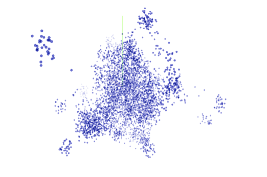
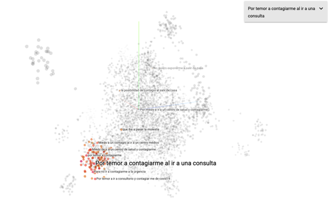
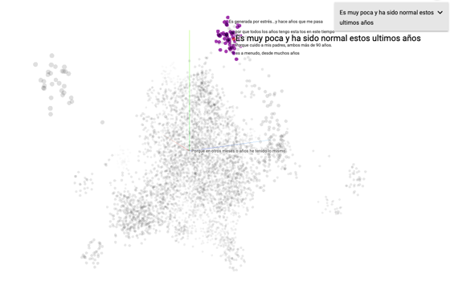

```{r setup, include=FALSE}
#Chunk options
knitr::opts_chunk$set(echo = TRUE, warning = FALSE, message= FALSE)


#Globalsetting
options(OutDec= "," , digits = 3, scipen = 3)

#UTF
Sys.setlocale("LC_ALL", "ES_ES.UTF-8")

#Ggplot
library("ggplot2"); theme_set(theme_classic())

```

```{r, include=FALSE, message=FALSE, warning=FALSE}

######Cargar paquetes-----

pacman::p_load(haven,
               dplyr,
               kableExtra,
               psych,
               knitr,
               captioner,
               stringr,
               data.table,
               scales,
               readxl)

######Cargar base de datos-----

#Base MOVID
movid <-
  read.csv("movid_inf1_20200525_an.csv",
    sep = ",",
    encoding = "UTF-8",
    stringsAsFactors = F, na.strings=c(""," ","NA"))

movid2 <- filter(movid, semana=="16" | semana=="17" | semana=="18" | semana=="19" | semana=="20")


```


<br><left><p style="line-height: 2em;" ><font size="3"><span style="color: #033C73">
**Jorge Pérez**
<left><p style="line-height: 2em;" ><font size="2.5"><span style="color: #033C73">
Depratamento de Ciencias de la Computación <br>
Universidad de Chile <br><br>
<left><p style="line-height: 2em;" ><font size="3"><span style="color: #033C73">
**Cristóbal Cuadrado**
<left><p style="line-height: 2em;" ><font size="2.5"><span style="color: #033C73">
Escuela de Salud Pública <br>
Universidad de Chile <br></span></font>
<span style="color: #343a40"><font size="2.5"></font> </span>
</p></left><br>

# Resumen

Este documento explica de manera muy resumida las técnicas que usamos para encontrar tópicos emergentes en la respuesta de texto libre ante la pregunta *¿Por qué no consultó a un profesional de la salud?* del panel MOVID-19 que hace seguimiento de la pandemia del COVID-19 en Chile. Logramos identificar categorías en los textos que no habían sido previamente consideradas en el panel incluyendo *Miedo a contagiarse* y *Saturación del sistema de salud*. Luego de identificar las nuevas categorías clasificamos de manera automática un conjunto de 10.072 textos libres. Tanto la identificación de los tópicos emergentes como la clasificación automática las realizamos con técnicas de Procesamiento de Lenguaje Natural, en particular, representaciones de palabras (*word embeddings*) construidas con Redes Neuronales Artificiales. Si bien no hemos evaluado la clasificación resultante exhaustivamente, estimamos un error menor al 10% a partir de una evaluación manual de los textos. <br><br>

# Sobre MOVID-19

El Monitoreo Nacional de Síntomas y Prácticas COVID-19 en Chile (MOVID-19) es un esfuerzo colaborativo entre la Universidad de Chile, el Colegio Médico de Chile y otras instituciones académicas tales como la Universidad Diego Portales, la Pontificia Universidad Católica de Chile, la Universidad San Sebastián y la Universidad Central, en el que participan académicos de diversas disciplinas aportando sus saberes para responder de manera dinámica e innovadora a los desafíos que nos plantea la necesidad de generar conocimiento al ritmo en que se desarrolla una pandemia. Para efectos de este análisis participaron `r format(length(movid2$id_movid), big.mark=" ")` personas, con al menos dos respuestas en el tiempo, durante 5 semanas, con participantes de 321 comunas del país.

Para saber más sobre MOVID-19, acceda al link [www.movid19.cl](https://www.movid19.cl/) <br><br>

# Datos

Los datos que utilizamos corresponden a 10.072 textos libres escritos como respuestas a la pregunta *Y, ¿por qué no ha consultado a un profesional de salud?* entre personas que declaran al menos un síntoma que podría ser compatible con COVID-19 del panel MOVID-19 (fiebre, tos, dificultad para respirar, dolor de garganta, dolor muscular, disminución o pérdida del olfato, dolor en el pecho, dolor de cabeza o diarrea) y que decidieron no consultar por dicha sintomatología. Esta pregunta tiene por objetivo explorar posibles barreras para la consulta médica en el contexto de la pandemia COVID-19 en Chile. <br><br>

# Métodos y resultados

La mayor parte del trabajo lo basamos en representaciones vectoriales de palabras (*word embeddings*). Estos vectores se construyen mediante el entrenamiento de redes neuronales artificiales utilizando grandes volúmenes de texto. En particular utilizamos representaciones pre-entrenadas que pueden encontrarse en el sitio [github.com/dccuchile/spanish-word-embeddings](https://github.com/dccuchile/spanish-word-embeddings)

Las características específicas de estos métodos están fuera del objetivo de este documento, pero el lector interesado puede consultar el mismo sitio anterior para ver ejemplos y entender su funcionamiento general. Lo único importante para efectos de este documento es entender que estos métodos permiten construir, para cada texto, un vector de números reales que representa el *significado* del texto. Los vectores iniciales que generamos tienen 300 dimensiones. 

Adicionalmente, usamos un método basado en representaciones vectoriales donde las palabras están acompañadas también de información contextual. En particular, para generar estas representaciones, usamos el método *bidirectional encoder representations from transformers (BERT)* y las representaciones pre-entrenadas en idioma español que pueden encontrarse en este sitio [github.com/dccuchile/beto](https://github.com/dccuchile/beto)

En este caso generamos vectores de 768 dimensiones. <br><br>

## Determinando tópicos

Una vez computadas las representaciones vectoriales para cada uno de los textos, estos pueden *proyectarse* en menos dimensiones de manera de poder visualizarlos y explorarlos. Hay diversos métodos de proyección. Nosotros utilizamos el método *t-distributed stochastic neighbor embedding* y proyectamos en 3 dimensiones usando el *embedding projector* de la librería Tensorflow.

A continuación mostramos una representación visual de los textos en 3 dimensiones (por razones evidentes, este documento no permite visualizar exactamente cómo nos lo permite la herramienta). Esta representación visual nos permitió identificar los tópicos a partir de cúmulos y una búsqueda manual. <br><br>


<br><font size="2.5"><p style="line-height: 0.8em;">*Figura 1.* Proyección 3D de la representación de los 10.072 textos de respuesta abierta.</font></p>
<br><br></left>


<br><font size="2.5"><p style="line-height: 0.8em;">*Figura 2.* Ejemplos de textos más similares al texto *Por temor a contagiarme al ir a una consulta*.</font></p>
<br><br></left>


<br><font size="2.5"><p style="line-height: 0.8em;">*Figura 3.* Ejemplos de textos más similares al texto *Es muy poca y ha sido normal estos últimos años*.</font></p>
<br><br></left>

En una inspección visual logramos identificar 6 categorías que parecían cubrir a la mayor parte de los textos que analizamos. Las categorías se enumeran a continuación:

- **Categoría 1**: *Síntomas habituales o atribuye a otra causa*.

- **Categoría 2**: *Síntomas leves o transitorios*.

- **Categoría 3**: *Miedo a contagiarse*.

- **Categoría 4**: *Considera que no tiene riesgo*.

- **Categoría 5**: *Saturación del sistema de salud*.

- **Categoría 6**: *Examen previo negativo*. <br><br>

## Asignando textos a las distintas categorías

Luego de la identificación manual realizamos un método de asignación de textos de manera simple en dos fases. Primero, elegimos manualmente un conjunto de textos de ejemplo perteneciente a cada una de las categorías (entre 10 y 20 por categoría) y calculamos sus vectores representantes. Llamemos *V<sub>k</sub>* al conjunto de todos los vectores de los textos manualmente asignados a la categoría *k*. Posteriormente, para asignar cada uno de los textos restantes a una de las 6 categorías, hicimos lo siguiente. Sea *u* el vector que representa al texto que queremos clasificar. Definimos la “distancia de *u* a la categoría *k*” como la distancia entre *u* y el vector de *V<sub>k</sub>* más cercano a *u*. Luego simplemente asignamos *u* a la categoría con la que tiene menor distancia. Note que la noción de *distancia* es crucial en el método. En nuestro caso, utilizamos el ángulo entre los vectores como una medida de qué tan cerca (o lejos) están. Repitiendo el proceso para cada texto terminamos con una asignación para todos nuestros datos. <br><br>

## Código y datos de la clasificación

Todo el código utilizado se puede encontrar en el sitio [github.com/dccuchile/movid19](https://github.com/dccuchile/movid19)

Los datos resultantes de la clasificación fueron puestos a disposición del equipo de desarrollo de MOVID-19. <br><br>

# Evaluación

No hemos tenido el tiempo de una evaluación exhaustiva del método, pero hicimos una evaluación simple clasificando manualmente un conjunto de 100 textos con lo que estimamos un error cercano de entre el 5% y el 10% dependiendo del método de embeddings utilizado. Esta evaluación nos sirvió también para elegir el método con menos error. <br><br>

# Posibles mejoras

Una mejora inmediata sería considerar varios métodos trabajando en conjunto en un formato de *votación*. Otra mejora sería entrenar un modelo supervisado considerando los embeddings solo como características para este modelo. Para lograr algo como esto necesitaríamos asignar una cantidad considerable de textos a las distintas categorías de manera manual. Consideramos que una asignación de alrededor de 500 textos nos daría resultados iniciales mejores que los que obtuvimos con este método levemente supervisado. <br><br>

# Uso del análisis en el contexto del panel MOVID-19

El análisis desarrollado ha permitido generar nuevas categorías emergentes ante la pregunta *Y, ¿por qué no ha consultado a un profesional de salud? Marque todas las opciones que correspondan* del panel MOVID-19. De esta manera, a contar del 25 de Mayo de 2020 las alternativas para los participantes son:

- Porque no le pareció importante. 

- Por el costo económico.

- Porque no sabía dónde realizarlo.

- Porque tenía que esperar mucho tiempo.

- Porque está evaluando si los síntomas empeoran antes de consultar.

- Por miedo a contagiarse (categoría emergente 3).

- Porque los síntomas son leves o habituales (categorías emergentes 1 y 2).

- Para no sobrecargar el sistema de salud (categoría emergente 5).

- Otra razón, ¿cuál?  ________________________

La categoría emergente 4 (*Considera que no tiene riesgo*) y 6 (*Examen previo negativo*) se incluirán dentro de la categoría *Porque no le pareció importante* y *Otra*, respectivamente. Semana a semana se evaluará el texto libre en caso de que se identifiquen nuevas categorías emergentes que sean candidatas a ser incorporadas. <br><br>
