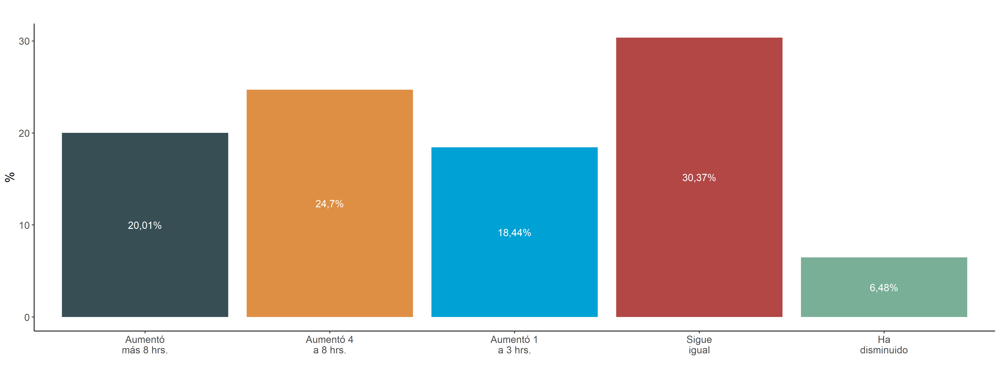

```{r setup, include=FALSE}
knitr::opts_chunk$set(echo = TRUE, message = F, warning = F, results = 'asis')
summarytools::st_options(bootstrap.css     = FALSE, 
           plain.ascii       = FALSE,      
           style             = "rmarkdown", 
           dfSummary.silent  = TRUE,        
           footnote          = NA,         
           subtitle.emphasis = FALSE)
library(ggplot2); theme_set(theme_classic() + theme(text = element_text(size = 12)))
library(knitr);  options(knitr.kable.NA = '')
```
```{r packages, echo = F}
# 1. Cargar paquetes
pacman::p_load(sjmisc, tidyverse, ggplot2, ggsci, googlesheets4, magrittr, kableExtra, ggpubr, chilemapas)
```
```{r load, echo = F}
#2. Cargar base de datos 
mv <- readRDS("movid.rds")
movid <- mv
mv <- mv %>% group_by(pob_id) %>% filter(semana == max(semana)) %>% ungroup(pob_id)
```

# Contexto

Hasta el día 9 de noviembre la pandemia COVID-19 en Chile ha producido 521.558 personas contagiadas y 14.543 personas fallecidas [(MINSAL, 2020)](https://www.minsal.cl/nuevo-coronavirus-2019-ncov/casos-confirmados-en-chile-covid-19/).La pandemia no solo ha tensionado fuertemente al sistema sanitario, si no que ha provocado una crisis relevante en lo económico y social (United Nations, 2020). La vida de las personas ha sido modificada en múltiples aspectos, mientras que una serie de comportamientos y rutinas han tenido que ser reorganizados. 

Un área que se ha visto fuertemente impactada por la pandemia ha sido el del cuidado de niños, niñas, adolescentes y personas en situación de dependencia. Una de las primeras medidas, que se mantiene hasta el día de hoy, fue el cierre de establecimientos educacionales y salas cuna, lo que significó el traslado de los cuidados de niños, niñas y adolescentes al hogar. El cuidado de personas mayores o con enfermedades crónicas también aumentó en demanda de cuidados y precauciones, dado que estas personas constituyen grupo de riesgo para COVID-19. Al mismo tiempo, el cuidado de personas en situación de dependencia en instituciones ha sido complejo, y muchas familias han optado por retirar a sus adultos mayores de los establecimientos y llevarlos a sus domicilios (Giebel, 2020). 

La organización del cuidado aumentado de estos grupos se ha visto dificultado por la reducción en las posibilidades de contratar a cuidadores externos al hogar. La contratación se ha visto comprometida por las cuarentenas, por el riesgo de contagio que significan estos traslados y por la disminución de la capacidad de pago de las familias. Esto se ha acompañado del traslado de una gran proporción del trabajo remunerado al hogar en formato de teletrabajo. Por ejemplo, el INE reporta que un 27,7% de los trabajadores realizó trabajo a distancia durante el mes de julio (INE, 2020). Lo anterior puede estar asociado a un aumento de la demanda de cuidados en horario laboral. 

En **MOVID-19** hemos preguntado durante las últimas semanas a nuestro/as participantes sobre su rol como cuidadores de niños, niñas y adolescentes y personas en situación de dependencia. Este informe MOVID-19
de la Universidad de Chile y del Colegio Médico de Chile, en conjunto con otras instituciones académicas del país, tiene por objeto contribuir a la pandemia por COVID-19 con un análisis que permita dar cuenta de la magnitud del problema en las limitaciones en el acceso a la atención y comprender las principales barreras encontradas. Este informe considera datos de 55.185 participantes. Esperamos que estos resultados sean valiosos para informar las decisiones del Gobierno y el Ministerio de Salud en los procesos de reactivación
del sector salud.

# ¿Quiénes son las personas que cuidan? 

En la encuesta MOVID-19, 8143 participantes indicaron ser cuidadores, correspondiendo a un 39,6% de la muestra. Esto incluye ser el cuidador principal de personas niños, niñas y adolescentes hasta 18 años o de personas mayores en situación de dependencia.

Al comparar la condición de cuidador según género, vemos que las mujeres asumen el rol de cuidadoras un 11,11% más que los hombres. Así, un 42,16% de las mujeres son cuidadoras, en comparación a un 31,05% de los hombres (Figura 1).

```{r, out.width = "100%", echo=F, cache=T}

```
**Figura 1.** Condición de cuidador/a por género  

En cuanto a las edades, vemos que el grupo con una mayor proporción de cuidadores es el de las personas entre 40 y 49 años (68,4%), seguido de entre 50 y 59 años (45,34%), 30 a 39 años (42,41%) y 60 a 69 años (21,52%) (Figura 2).   

```{r, out.width = "100%", echo=F, cache=T}

```
**Figura 2** Condición de cuidador/a por grupo etáreo <br><br><br> 

En cuanto a la condición de cuidador según nivel socioeconómico no se observan grandes diferencias. Un 38,68% de las personas profesionales son cuidadoras, seguido de 40,67% de las personas con educación media como máximo nivel alcanzado y un 42,23% de las personas con educación técnica. Esto se acompaña de una distribución similar entre personas según su seguro de salud. 

Sobre la ocupación de las personas que cuidan, lógicamente la mayor proporción de cuidadores se da entre personas que trabajan en el hogar, con un 68,41% de esta categoría como cuidadoras. En contraste, el 43,1% de las personas que trabajan de forma remunerada son cuidadores y un 39,91% de las personas desempleadas (Figura 3). 


```{r, out.width = "100%", echo=F, cache=T}

```
**Figura 3** Condición de cuidador por ocupación

# Tipos de cuidadores 

De la muestra, 2112 participantes (10,27 %) indicaron ser el/la cuidador principal de menores de 5 años, 4528 personas (22,02 %) mencionaron serlo de menores entre 6 y 18 años y 2241 (10,89 %) personas reportaron
serlo de personas adultas en situación de dependencia.

Las mayores diferencias de género se dieron entre las personas que son cuidadores principales de niño/as entre 6 y 18 años, con un 23,88% de las mujeres en comparación a un 17,05% de los hombres. Cuando comparamos a los tres grupos de personas que cuidan (niño/as entre 0 y 5 años, niño/as y adolescentes entre 6 y 18 años y personas en situación de dependencia), estos son similares en términos de género con un representación del género femenino de un 77,36 %, 76,04% y 72,56 %, respectivamente. Respecto a la edad, las personas que cuidan niño/as menores de 5 años tienden a tener en mayor medida entre 18 y 39 años (52,54 %), mientras que las personas que cuidan a menores entre 6 y 18 años y a personas en situación de dependencia tienen en mayor medida entre 40 y 64 años (79,53% y 74,36 %, respectivamente). Finalmente,
los 3 grupos son similares en términos socioeconómicos.

# El aumento de cuidados durante la pandemia

Se evaluó el cambio en la carga de cuidados que han tenido las personas durante la pandemia. Un 20,03% refiere que su carga de cuidados ha aumentado más de 8 horas al día, un 24,65% indica que lo ha hecho entre 4 y 8 horas y un 18,84% entre 1 y 3 horas. Un 30,38% refiere que su carga de cuidado se ha mantenido durante la pandemia y un 6,09% que ha disminuido (Figura 4).

```{r, out.width = "100%", echo=F, cache=T}

```
**Figura 4** Aumento de los cuidados durante la pandemia

# Factores que explican el aumento de cuidados 

Cuando comparamos este aumento de cuidados entre hombres y mujeres, vemos que hay un aumento mayor en los cuidados en el género femenino (Figura 5). Durante la pandemia un 22,23% de las mujeres aumentó más de 8 horas su carga diaria de cuidados, en comparación a un 13,3% de los hombres. A su vez, un 26,17% de las mujeres aumentó su carga entre 4 y 8 horas, en comparación con un 20,01% de los hombres. Por otro lado, un 37,93% de las personas de género masculino refiere que su carga de cuidados sigue igual, en comparación a un 27,88% del género femenino. 


```{r, out.width = "100%", echo=F, cache=T}

```
**Figura 5** Aumento de cuidados según carga de cuidados y sexo (%) 

Por último, se realizó un análisis de regresión logística ordinal para evaluar factores que se asocian a un aumento de la carga de cuidados (ver Figura 1). Los resultados evidencian que los factores más importantes son la edad y el género de los/as cuidadores/as. Los resultados del modelo muestran que las personas entre 18 y 39 años tienen chances de haber aumentado su carga de cuidado durante la pandemia que son mayores en un 106% a las chances de las personas de 65 años y más. A su vez, las personas de entre 40 y 64 años tienen chances mayores en un 46% en comparación con el grupo de mayor edad. Al mismo tiempo, las mujeres tienen chances de haber aumentado sus tareas de cuidado que son mayores en un 58% al de los hombres.  Llama también la atención que lo/as cuidadores de niño/as menores de 5 años presentan chances mayores en un 142% que otros/as cuidadores, mientras que los cuidadores de menores entre 6 y 18 años tienen chances maores en un 63%. El nivel educacional, seguro de salud o región no mostraron ser relevantes en el aumento de la carga en este modelo. 


```{r, out.width = "100%", echo=F, cache=T}

```
**Figura 6** Factores que predicen aumento de cuidados durante la pandemia (Odds Ratios)

# Recomendaciones

1. *Sistema Nacional de Cuidados*: El aumento de la carga de cuidados se ha descrito a nivel internacional, lo que ha llevado a ciertos autores a llamar a la/os cuidadores “la primera línea invisible” de la fuerza de trabajo (Phillips, 2020). Es necesario considerar que en nuestro país esta primera línea es altamente precarizada, ya que es un trabajo habitualmente no remunerado, que provoca una alta demanda física y emocional y que ha tenido escaso apoyo económico por parte del estado. Estos resultados llaman a la evaluación de medidas de apoyo a las personas que cuidan en el ámbito laboral y social. Esto también abre la discusión sobre la implementación de un sistema nacional de cuidados que apoye a las personas que efectúan tareas de cuidado. 

2. *Mujeres y empleo*: Según datos del INE, la tasa de ocupación de las mujeres ha disminuido a un 42%, lo que es 10 puntos menor que la ocupación a la misma fecha el año pasado. Así, durante la pandemia se han perdido 900.000 empleos femeninos y se ha identificado que un 88% no está buscando trabajo. Esto se debe probablemente a la incompatibilidad para trabajar con la carga de cuidados que relata este informe. Frente a esto, en el contexto de reactivación es necesario considerar subsidios al empleo focalizados en las mujeres para reducir las brechas que ha profundizado esta pandemia.  

3. *Salas cuna y postnatal*: El mayor aumento en los cuidados se asocia a personas que cuidan niño/as menores de 5 años. En contexto de que recientemente se terminaron los primeros 90 días de postnatal de emergencia para las madres que terminaron su postnatal desde marzo hasta la aprobación del mismo, es necesario evaluar nuevas formas de apoyo al cuidado de este grupo. Alternativas posibles son la extensión del postnatal sobre esos 90 días o la apertura de salas cuna, con las medidas pertinentes y en función del contexto sanitario. Sin estas medidas, es difícil que las trabajadoras se puedan reintegrar a sus funciones. 

4. *Apertura de colegios*: Es necesaria una planificación coordinada de la vuelta a clases en función del contexto sanitario, en la cual dialoguen todos los actores relevantes (profesores, padres, estudiantes, Ministerio de Educación, transportistas) para una respuesta planificada y concertada por los actores. Esto es importante desde el punto de vista del desarrollo de los estudiantes, como de la compatibilización del trabajo con las labores de cuidado. 

5. *Estereotipos de género*: El informe evidencia un aumento relevante en las tareas de cuidados durante la pandemia, especialmente para las mujeres e independiente del nivel educacional de las mismas. La distribución de los cuidados entre los géneros tradicionalmente no ha sido azarosa. Históricamente al género femenino se le ha relegado un rol preponderante en los cuidados del hogar y de terceros. Esto está asociado a un estereotipo de femeneidad que le atribuye a este género el rol del cuidado y el trabajo en el hogar - no remunerado-, atribuyendo al género masculino el rol del trabajo remunerado. Sin embargo, a pesar de que con el tiempo las mujeres se han incorporado al mundo del trabajo formal, continuan teniendo una carga de trabajo de cuidados persistentemente mayor (INE, 2015), lo que afecta su calidad de vida de manera relevante. **Es necesario promover un cambio que reduzca los estereotipos de género que provocan estas diferencias.** 
 

# Sobre MOVID-19

El **Monitoreo Nacional de Síntomas y Prácticas COVID-19 en Chile (MOVID-19)** es un esfuerzo colaborativo entre la Universidad de Chile, el Colegio Médico de Chile y otras instituciones académicas tales como la Universidad Diego Portales, la Pontificia Universidad Católica de Chile, la Universidad San Sebastián, la Universidad Central y la Universidad de La Frontera, en el que participan académicos de diversas disciplinas aportando sus saberes para responder de manera dinámica e innovadora a los desafíos que nos plantea la necesidad de generar conocimiento al ritmo en que se desarrolla una pandemia. A la fecha han participado 55.185 personas con al menos dos respuestas en el tiempo durante las últimas 26 semanas, con participantes de 324 comunas del país.

Para saber más sobre MOVID-19 y la metodología del estudio, acceda a [www.movid19.cl](https://movid19.cl/). Accede a más publicaciones siguiendo [este enlace](https://movid19.cl/publicaciones).
