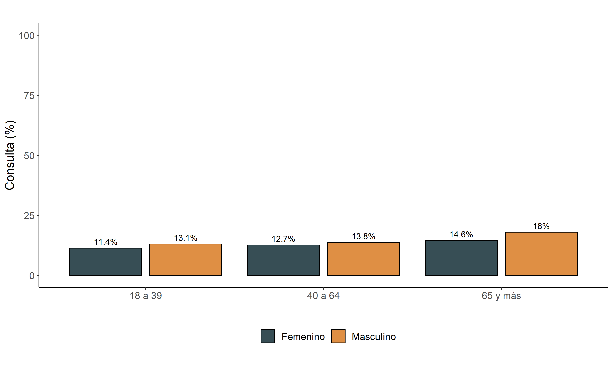
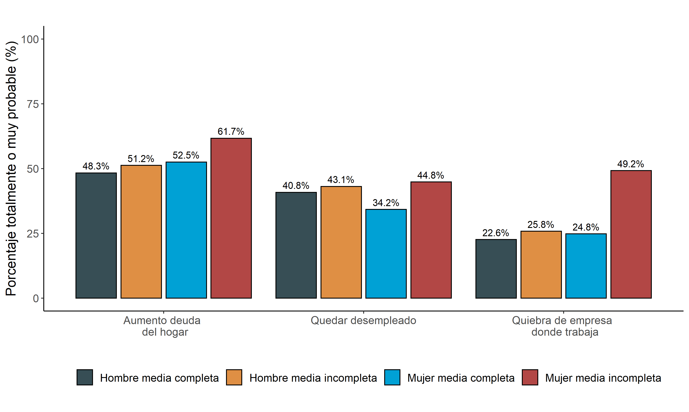
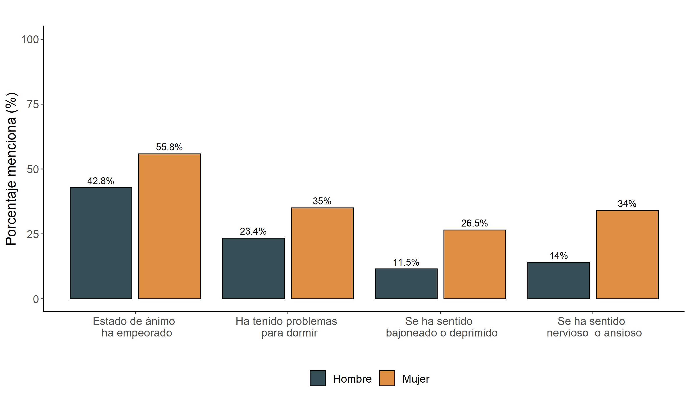
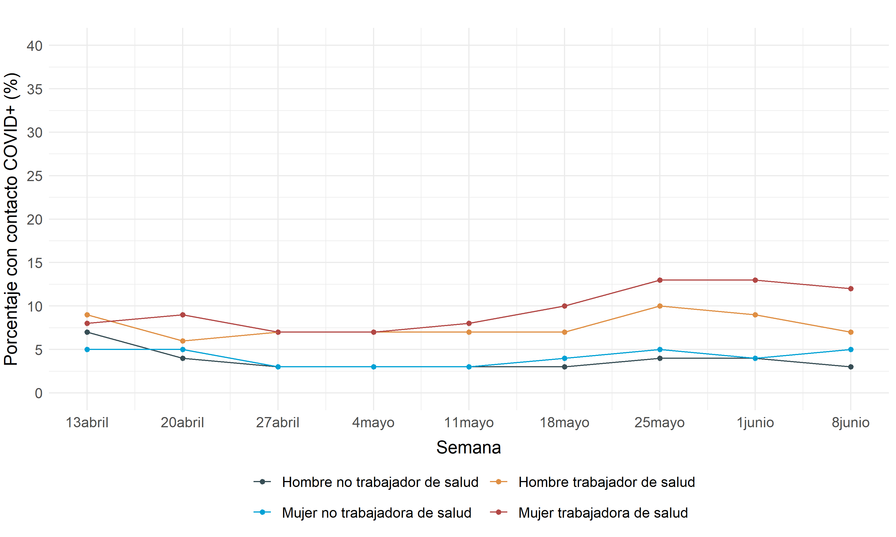

```{r setup, include=FALSE}
#Chunk options
knitr::opts_chunk$set(echo = TRUE, warning = FALSE, message= FALSE)
```


```{r, include=FALSE, message=FALSE, warning=FALSE}
# 1. Cargar librarias
pacman::p_load(haven,
               dplyr,
               kableExtra,
               knitr)
# 2, Cargar bases de datos

#Base MOVID
#movid <-read.csv("C:/Users/Valentina Andrade/Dropbox/MOVID-19/analisis/bases_anonimizadas/movid_20200713.csv",sep = ",",encoding = "UTF-8",stringsAsFactors = F, na.strings=c(""," ","NA"))
```


# Contexto
Hasta el día 22 de junio, en Chile hay 246.963 personas contagiadas por COVID-19 [(MINSAL, 2020)](https://www.minsal.cl/nuevo-coronavirus-2019-ncov/casos-confirmados-en-chile-covid-19/). Más allá de los resultados sanitarios, la pandemia por COVID-19 ha tenido importantes consecuencias sociales. **Un grupo que ha estado particularmente expuesto durante esta crisis han sido las mujeres**. Primero, la tasa de desempleo entre mujeres ha aumentado a cifras históricas y de manera más abrupta que la de los hombres [(INE, 2020)](https://www.ine.cl/docs/default-source/ocupacion-y-desocupacion/boletines/2020/pa%C3%ADs/bolet%C3%ADn-empleo-nacional-trimestre-m%C3%B3vil-febrero-marzo-abril-2020.pdf?sfvrsn=31a52923_4). Las mujeres se encuentran sobrerepresentadas en trabajos informales y precarios, como es el caso de las trabajadoras de casa particular y vendedoras de comercio [(INE, 2020)](https://www.ine.cl/docs/default-source/ocupacion-y-desocupacion/boletines/2020/pa%C3%ADs/bolet%C3%ADn-empleo-nacional-trimestre-m%C3%B3vil-febrero-marzo-abril-2020.pdf?sfvrsn=31a52923_4). Son justamente estas ocupaciones las que se están viendo y se verán más afectadas durante la crisis. Segundo, las mujeres corresponden al 70% de la fuerza de trabajo en los servicios de salud y sociales [(CASEN, 2017;](http://observatorio.ministeriodesarrollosocial.gob.cl/casen-multidimensional/casen/docs/Resultados_trabajo_Casen_2017.pdf) [COLMED, 2020)](http://www.colegiomedico.cl/wp-content/uploads/2020/05/Genero_COVID19_compressed.pdf). Tercero, las cuarentenas y el cierre de establecimientos educacionales han aumentado la demanda de cuidados y tareas educativas dentro del hogar, cargas que en nuestro país ya desde antes recaían desproporcionadamente sobre la mujer [(ENUT, 2015)](https://historico-amu.ine.cl/enut/files/principales_resultados/documento_resultados_ENUT.pdf). Cuarto, en situaciones de emergencia el acceso a prestaciones en salud sexual y reproductiva suelen verse comprometidas [(UNFPA, 2020)](https://www.unfpa.org/sites/default/files/resource-pdf/COVID-19_impact_brief_for_UNFPA_23_April_2020_ES.pdf). Por último, las cuarentenas han aumentado las expresiones de violencia de género a nivel internacional [(Bradbury-Jones & Isham, 2020)](https://onlinelibrary.wiley.com/doi/pdf/10.1111/jocn.15296). El objetivo de este informe es  **analizar la situación de mujeres y trabajadoras de la salud en esta crisis social en Chile y reflexionar sobre cómo reducir el efecto negativo de la misma**. Considerar el desarrollo de políticas sociales desde una mirada de género resulta fundamental para no poner en peligro los avances que se han realizado en Chile en la reducción de brechas de género. 

En este **quinto informe de MOVID-19 a la Mesa Social COVID-19** presentamos resultados de 45.499 participantes, recogidos a lo largo de nueve semanas. Este informe es el resultado de una colaboración entre la Universidad de Chile y el Colegio Médico, con aportes de la Universidad Diego Portales, la Pontificia Universidad Católica de Chile, la Academia de Humanismo Cristiano, entre otras. A su vez, este informe constituye una colaboración con el trabajo realizado por el Centro Microdatos (CMD), el Núcleo Milenio en Desarrollo Social (DESOC) y el Centro de Estudios de Conflicto y Cohesión Social (COES), presentando también resultados del Termómetro Social, cuyo tabajo de campo se desarrolló entre el 30 de mayo y el 10 de junio 2020 (revisar más información en [este sitio web](https://www.microdatos.cl/termometro-social-junio)). 


# Barreras de acceso para mujeres y hombres
<left>
```{r, out.width = "100%",echo=F, cache=T}

```
<font size="2"><p style="line-height: 1em;">*Figura 1. * Porcentaje que consulta a personal de salud entre personas que constituyen caso sospechoso (n = 17.920). Elaboración propia en base a datos MOVID-19.
</font></p>
</left>

Comenzamos analizando posibles **barreras de acceso de las mujeres al sistema de salud**. El diagnóstico precoz resulta la mejor estrategia para enfrentar la pandemia, incrementando las probabilidades de aislar oportunamente a las personas contagiadas. [(OMS, 2020)](https://www.who.int/publications-detail/critical-preparedness-readiness-and-response-actions-for-covid-19). Si bien estudios nacionales muestran que en otros momentos las mujeres tienden a consultar más que los hombres [(Vega et al., 2003)](https://pubmed.ncbi.nlm.nih.gov/12942596/), los datos MOVID-19 sugieren algo distinto. **Entre participantes MOVID-19 que constituyen caso sospechoso, la probabilidad de consultar es mayor entre hombres que entre mujeres**. Esta diferencia es particularmente marcada entre personas de 65 y más años (Figura 1). Así, el 18% de los hombres mayores de 65 años con síntomas sospechosos de enfermedad por COVID-19 indicó haber consultado la semana pasada, mientras esta cifra solamente alcanza al 14,6% de las mujeres de misma edad. Cabe destacar que esta diferencia se mantiene aún controlando por otras variables socio-demográficas y de acceso a salud [(MOVID-19, 2020)](https://www.movid19.cl/informes/mesasocial4.html).


# Consecuencias de la crisis sanitaria para mujeres y hombres
<left>
```{r, out.width = "100%",echo=F, cache=T}

```

<font size="2"><p style="line-height: 1em;">*Figura 2. * Incertidumbre sobre el futuro laboral según sexo y nivel educacional. Elaboración propia en base a Termómetro Social (CMD, DESOC, COES). (n = 1078) </font></p></left>

La inestabilidad laboral a la que las mujeres se ven normalmente expuestas se ve acentuada en el contexto de la crisis sanitaria. Según datos de la Encuesta Termómetro Social, **la incertidumbre laboral está particularmente presente entre mujeres que no han terminado su educación media** (ver Figura 2). En particular, 49,2% de estas mujeres estima que es totalmente o muy probable que la empresa donde trabajan quiebre en los próximos tres meses, mientras que el 61,7% estima que las deudas de su hogar aumentarán. Estos porcentajes son notoriamente mayores a los reportados por hombres de distintos niveles educativos y por mujeres con mayor nivel educacional. 

Más allá de las mayores cifras de desempleo, la percepción de inestabilidad laboral entre mujeres con niveles educacionales más bajos da cuenta de una sensación de desprotección social en el contexto de la crisis. Este dato también pone de manifiesto las diferentes realidades que la pandemia genera para mujeres de distintos estratos sociales. Por otro lado, el cierre de establecimientos educacionales conlleva un aumento de tareas de cuidado y educativos en el hogar para mujeres [(COLMED, 2020)](http://www.colegiomedico.cl/wp-content/uploads/2020/05/Genero_COVID19_compressed.pdf) lo que afecta su desempeño laboral y su posibilidad de reingresar al mundo laboral post-pandemia. 

<left>
```{r, out.width = "100%",echo=F, cache=T}

```
<font size="2"><p style="line-height: 1em;">*Figura 3. * Síntomas de salud mental según sexo. Elaboración propia en base a Termómetro Social (CMD, DESOC, COES). (n = 1078)
</font></p></left>

**Las mujeres son también las que han visto su salud mental mayormente afectada**. Así, según datos del Termómetro Social (ver Figura 3), 55,8% de las mujeres indica que su estado de ánimo ha empeorado durante los meses de crisis sanitaria, mientras que solamente el 42,8% de los hombres estima lo mismo. Las mujeres también mencionan, en mayor medida que los hombres, la presencia de problemas para dormir, sentirse bajoneada o deprimida, así como nerviosa o ansiosa. Estos indicadores de salud mental más negativos en mujeres podrían reflejar la sobrecarga que las mujeres tienen en relación a los cuidados del hogar, la preocupación con la potencial pérdida de su fuente laboral y el aumento de expresiones de violencia de género en contexto de cuarentenas. 


# Bienestar de trabajadoras de salud
Un grupo de mujeres que requiere particular atención en el contexto actual es el de las trabajadoras de salud. Las trabajadoras de salud no solamente corresponden al mayor porcentaje de la fuerza laboral en salud, sino que también tienden a ocupar cargos que involucran mayor interacción con pacientes. Los resultados de MOVID-19 muestran que **las mujeres trabajadoras de la salud tienen más contacto con personas COVID-positivas, en comparación con los hombres trabajadores de la salud** (ver Figura 4). Por ejemplo, la semana del 8 de junio, un 11,9% de las mujeres trabajadoras en salud indicó haber tenido contacto con una persona COVID-positiva, mientras que este valor se reducía a 6,9% de los hombres trabajadores en salud, al 5,0% de las mujeres no trabajadoras en salud y al 3,5% de los hombres no trabajadores en salud. Así, las trabajadoras en salud presentaron una exposición mayor en un 72,5% a los hombres trabajadores en salud y mayor en un 138% a la exposición de mujeres no trabajadoras en salud. Estas cifras resaltan la necesidad de asegurar elementos de protección personal para el equipo de salud completo, y manifiestan la relevancia de considerar las distintas necesidades y circunstancias de distintos grupos de mujeres. 

<left>
```{r, out.width = "100%",echo=F, cache=T}

```
<font size="2"><p style="line-height: 1em;">*Figura 4. * Porcentaje de contacto con personas COVID+ según sexo y área laboral (salud o no). Elaboración própia en base a estudio MOVID-19 (n = 45499)   </font></p></left>


# Recomendaciones

1. **Evitar que brechas de género en ámbito laboral aumenten**. Es importante generar políticas públicas de protección del empleo que logren reducir la pérdida del trabajo entre mujeres. Considerando que en Chile las mujeres representan en mayor porcentaje la fuerza laboral informal, es necesario generar mecanismos legales de protección de sus fuentes de ingreso, particularmente enfocados en reducir la pérdida de empleo entre mujeres. Por ejemplo, generar incentivos para la formalización de contratos de trabajadoras de casa particular, de manera de garantizar la continuidad de su fuente de ingreso durante la duración de la pandemia. Para aquellas trabajadoras de casa particular que sí tienen contrato, asegurar el cumplimiento de la normativa para incorporarlas en el seguro de cesantía. Por otro lado, deben introducirse apoyos económicos a sectores de la economía donde la fuerza laboral femenina es mayoritaria, tales como las actividades de atención a la salud y asistencia social, así como el trabajo de ventas en el comercio. 

2. **Introducir el postnatal de emergencia**. Ante el aumento del desempleo entre mujeres y los altos niveles de inestabilidad de trabajos feminizados, existe el riesgo de no poder reingresar al mundo laboral por parte de mujeres que están dentro de su período postnatal. De esta manera, es importante aumentar la duración del período de postnatal mientras no estén garantizadas las condiciones necesarias para que las mujeres puedan retornar al mundo laboral. 

3. **Aumentar el apoyo psicosocial a mujeres y fortalecer la corresponsabilidad social en el hogar**. El aumento en la demanda de cuidados, el temor a perder el trabajo y la violencia de género puede afectar especialmente la salud mental de las mujeres durante la pandemia. Considerando el aumento de sintomatología negativa (peor estado de ánimo, dificultades para dormir, síntomas depresivos y ansiógenos) más acentuado entre mujeres, es importante garantizar mecanismos de apoyo a la salud mental, tales como acceso a consultas de salud mental, tratamientos farmacológico y psicoterapia. Con respecto a la violencia de género, se deben mejorar los canales de atención y denuncia, destinar mayores recursos para la atención a víctimas de violencia de género y fortalecer las redes comunitarias para enfrentar la violencia durante la cuarentena. A su vez, para disminuir la carga global de trabajo de mujeres y promover su bienestar, resulta fundamental avanzar en fortalecer la corresponsabilidad social en el cuidado, las tareas educativas y los quehaceres del hogar.  

4. **Fortalecer ayudas a trabajadoras de la salud**. Se requiere asegurar la disponibilidad de elementos de protección personal para todo el personal de salud, y una política de apoyo a los cuidados de los hijo/as del personal de salud que incluya adaptación de horarios y ayuda económica para el cuidado. Por otro lado, la alta demanda de cuidados en el hogar puede ser especialmente importante para las trabajadoras de la salud, ya que deben mantener su trabajo presencial en un contexto de cierre de establecimientos educacionales, salas cunas y protección de personas mayores (que habitualmente cuidan a nieto/as).  Es por esto que se sugiere un apoyo integral al cuidado de hijo/as de personal de salud, que incluya adaptación de horarios y apoyo económico para el cuidado de sus hijos/as.


# Sobre MOVID-19
El **Monitoreo Nacional de Síntomas y Prácticas COVID-19 en Chile (MOVID-19)** es un esfuerzo colaborativo entre la Universidad de Chile, el Colegio Médico de Chile y otras instituciones académicas tales como la Universidad Diego Portales, la Pontificia Universidad Católica de Chile, la Universidad San Sebastián y la Universidad Central, en el que participan académicos de diversas disciplinas aportando sus saberes para responder de manera dinámica e innovadora a los desafíos que nos plantea la necesidad de generar conocimiento al ritmo en que se desarrolla una pandemia. A la fecha han participado 45.499 personas con al menos dos respuestas en el tiempo durante las últimas nueve semanas, con participantes de 326` comunas del país.

Para saber más sobre MOVID-19 y la metodología del estudio, acceda a [www.movid19.cl](http://www.movid19.cl)
