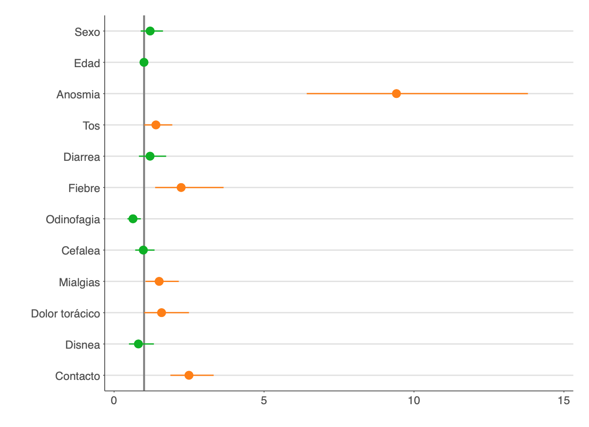
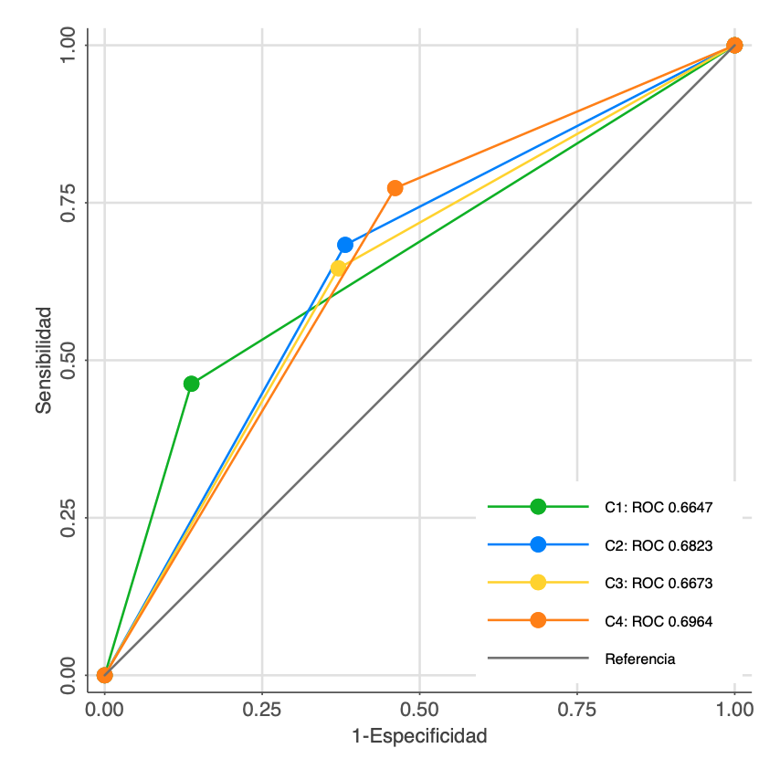

```{r setup, include=FALSE}
#Chunk options
knitr::opts_chunk$set(echo = TRUE, warning = FALSE, message= FALSE)
```


```{r, include=FALSE, message=FALSE, warning=FALSE}
#Table numbers

table_nums <- captioner::captioner(prefix = "Tabla")

tab1_cap <- table_nums(name = "tab_1", 
                        caption = "Comparación entre casos confirmados y controles en MOVID-19")

tab2_cap <- table_nums(name = "tab_2", 
                        caption = "Resultados análisis de sensibilidad y especificidad en la determinación de casos COVID-19 - Criterio 1")
tab3_cap <- table_nums(name = "tab_3",
                       caption = "Resultados análisis de sensibilidad y especificidad en la determinación de casos COVID-19 - Criterio 2")

tab4_cap <- table_nums(name = "tab_4",
                       caption = "Resultados análisis de sensibilidad y especificidad en la determinación de casos COVID-19 - Criterio 3")

tab5_cap <- table_nums(name = "tab_5",
                       caption = "Resultados análisis de sensibilidad y especificidad en la determinación de casos COVID-19 - Criterio 4")

tab6_cap <- table_nums(name = "tab_6",
                       caption = "Comparación de sensibilidad y especificidad de distintos criterios")

#Funcion de referencia
f.ref <- function(x) {
  stringr::str_extract(table_nums(x), "[^:]*")
}
# 1. Cargar librarias
pacman::p_load(haven,
               dplyr,
               kableExtra,
               knitr)
# 2, Cargar bases de datos

#Base MOVID
#movid <-read.csv("C:/Users/Valentina Andrade/Dropbox/MOVID-19/analisis/bases_anonimizadas/movid_20200713.csv",sep = ",",encoding = "UTF-8",stringsAsFactors = F, na.strings=c(""," ","NA"))
#Tablas
tabla1 <- readxl::read_excel("Tabla_1.xlsx")
tabla1[is.na(tabla1)] <- " "
tabla2 <- readxl::read_excel("Tabla_2.xlsx")
tabla3 <- readxl::read_excel("Tabla_3.xlsx")
tabla4 <- readxl::read_excel("Tabla_4.xlsx")
tabla5 <- readxl::read_excel("Tabla_5.xlsx")
tabla6 <- readxl::read_excel("Tabla_6.xlsx")
tabla6[is.na(tabla6)] <- " "
```


# Contexto

La pandemia COVID-19 en Chile ha producido 105.159 personas contagiadas, 1.113 personas fallecidas, con 59.100 casos activos estimados por el Ministerio de Salud al 1 de junio 2020. Si bien se han instaurado medidas de distanciamiento social amplias en la Región Metropolitana, el mayor foco de contagio actual, el número de casos sigue aumentando. Uno de los principales desafíos a los que se enfrenta el país en la actualidad es poder **identificar precozmente** a los casos sospechosos para poder **aislarlos**, al mismo tiempo que poder **trazar** sus contactos. Esta es la intervención clave para frenar la cadena de transmisión. 

En el marco del fortalecimiento de la vigilancia epidemiológica, se establecieron definiciones de caso sospechoso, caso probable y caso confirmado. La definición de caso sospechoso es fundamental para evitar la trasmisión de esta patología mediante el aislamiento temprano de estos casos. A la fecha, estas definiciones han sufrido modificaciones basadas en las recomendaciones de expertos y el comportamiento de la enfermedad en el país. Sin embargo, **la capacidad de detección de sanos o enfermos no ha sido analizada**.

En este contexto, la Universidad de Chile y el Colegio Médico de Chile en conjunto con otras instituciones académicas del país está desarrollando el proyecto MOVID-19. Este breve informe desarrollado en conjunto con la Universidad San Sebastián tiene por objeto contribuir con un análisis que permita mejorar la definición de caso sospechoso acorde a nuestra realidad epidemiológica. Este informe utiliza datos de 39 885 participantes MOVID-19 de todo Chile, con 148 795 observaciones observaciones durante las últimas seis semanas. Esperamos que estos datos sean valiosos para informar las decisiones del Gobierno a través de la Mesa Social COVID-19. 


# Definiciones de caso sospechoso

La primera definición para caso sospechoso oficializada a través de decreto del Ministerio de Salud se realizó el 23 de marzo [(MINSAL, 2020)](https://www.minsal.cl/wp-content/uploads/2020/04/Ord.-B51-N%C2%BA933.pdf). Posteriormente, el Consejo Asesor recomendó una nueva definición a través de la minuta publicada el 26 de marzo [(Consejo Asesor COVID-19, 2020)](https://drive.google.com/file/d/1ppSNUnFfuVKoHrN0_XMaNXVaNMP0VqSz/view) y la última actualización fue anunciada a través de la cuenta pública del 30 de mayo [(MINSAL, 2020)](https://www.diariooficial.interior.gob.cl/publicaciones/2020/05/30/42668/01/1768100.pdf). Dado el decreto recientemente publicado, la norma vigente corresponde a la definición del 30 de mayo. 

```{r , echo=FALSE, fig.cap= F}
knitr::kable(tabla1, digits = 2, row.names = F,  booktabs = T,
             col.names = c(" ", "No", "Sí", "Total"),
             caption = tab1_cap) %>%
            add_header_above(c(" " = 1, "Examen confirmado" = 3)) %>%   
            pack_rows("Características socio-demográficas", 2, 3) %>%
            pack_rows("Síntomas", 4, 12) %>%
            pack_rows("Contacto", 13, 13) %>%
            kableExtra::kable_styling(latex_options = "hold_position")%>%
            kableExtra::kable_styling(bootstrap_options = "striped", full_width = T)%>%
            kableExtra::column_spec(1, width = "7cm")%>%
            kableExtra::footnote(general = "Elaboración propia en base a datos MOVID-19", general_title = "Fuente:")
```


En este informe, se realizó un análisis de sensibilidad (capacidad de una prueba para detectar la enfermedad entre los sujetos enfermos) y especificidad (capacidad de la prueba para detectar la ausencia de la enfermedad entre sujetos sanos) de las últimas tres definiciones de caso sospechoso, utilizando como estándar de referencia a los pacientes que reportan en MOVID-19 la confirmación diagnóstica de COVID-19 a través de PCR. Luego, se realizó un modelo que permitiera explorar las variables con mayor capacidad predictiva. Para el análisis se consideraron la edad, el sexo y un conjunto de nueve signos y síntomas asociados a COVID-19 en base a la literatura internacional [(Wynants et al, 2020)](https://www.bmj.com/content/bmj/369/bmj.m1328.full.pdf) (tos, fiebre, cefalea, anosmia, diarrea, dolor torácico, mialgias, odinofagia y disnea). En función de este análisis, se termina por proponer una cuarta definición de caso sospechoso.

Para este análisis, se consideraron un total de 330 participantes MOVID-19 como casos confirmados (PCR+) y 1.694 controles con exámenes negativos (PCR-). El promedio de edad de los participantes es de 43,1 años (DE=12,8) y un 71,3% son mujeres. Los principales signos y síntomas observados en aquellos que tuvieron una PCR+ fueron: cefalea (55,5%); tos (45,8%); mialgias (43,0%) y anosmia (39,1%). Además, un 49,4% presentó contacto estrecho con una persona diagnosticada con COVID-19. La comparación de las características de quienes fueron confirmados como casos y quienes no, se describe en la Tabla 1.


## Criterio caso sospechoso 1 (Decreto MINSAL 23 de Marzo)

En el decreto del día 23 de marzo [(MINSAL, 2020)](https://www.minsal.cl/wp-content/uploads/2020/04/Ord.-B51-N%C2%BA933.pdf) para la actualización de la definición de caso sospechoso, se declaró la obligatoriedad de notificar a toda persona que cumpliera con alguno de los siguientes criterios:

a. Viajeros: Paciente con enfermedad respiratoria aguda que presente fiebre o al menos un signo o síntoma de enfermedad respiratoria; y con historia de viaje o residencia país/área o territorio que reporta casos de COVID-19, durante 14 días previos a los síntomas.

b. Contactos: Paciente con cualquier enfermedad respiratoria aguda; y con antecedentes de contacto con un caso confirmado o sospechoso de COVID-19 en los últimos 14 días previos a los síntomas.

c. Circulación local: Paciente con infección respiratoria aguda que sea residente o se encuentre de paso en una región con circulación comunitaria de SARS-COV-2; y que presenta fiebre (37,8 ºC) y al menos uno de los siguientes síntomas: odinofagia, tos, mialgias o disnea.

d. Vigilancia: Paciente con infección respiratoria aguda grave (que requiere hospitalización).

Al realizar las estimaciones de sensibilidad y especificidad para este criterio, se observó que 142 personas fueron correctamente clasificadas como sospechosas de COVID-19 de las 324 personas que fueron confirmadas con PCR (verdaderos positivos). Por lo tanto, el criterio no identificó como sospechosos a 182 personas que realmente padecían la enfermedad (falsos negativos) (Tabla 2). El criterio de caso sospechoso 1 sólo es capaz de identificar de manera correcta al enfermo - persona que reporta PCR+ - en un 43,8% de los casos. Este resultado se explica por la moderada sensibilidad estimada para este criterio (43,8%). Mientras que la especificidad del criterio fue alta (86,2%), indicando que la definición de caso sospechoso 1 permite discriminar a aquellos pacientes sanos.

```{r , echo=FALSE}
knitr::kable(tabla2, digits = 2, row.names = F,  booktabs = T,
             col.names = c("Examen PCR confirmado", "Sospechoso", "No sospechoso", "Total"),
             caption = tab2_cap) %>%
            kableExtra::kable_styling(latex_options = "hold_position")%>%
            kableExtra::kable_styling(bootstrap_options = "striped", full_width = T)%>%
            kableExtra::column_spec(1, width = "7cm") %>%
            kableExtra::footnote(general = "Seis sujetos no cuentan con toda la información para clasificarlos con el criterio. Fuente: Elaboración propia en base a datos MOVID-19.", general_title = "Nota:")
```


## Criterio caso sospechoso 2 (Recomendación Consejo Asesor 26 de marzo)

En la minuta publicada el 26 de marzo [(2020)](https://drive.google.com/file/d/1ppSNUnFfuVKoHrN0_XMaNXVaNMP0VqSz/view), el Consejo Asesor propone una nueva definición de caso sospechoso que considera la presentación de los siguientes síntomas compatibles con COVID-19:

a. Fiebre (temperatura axilar mayor a 37,8ºC), sin otra causa evidente, y/o,

b. Síntomas sugerentes de infección respiratoria tales como mialgias, odinofagia, tos, o disnea, dolor torácico, abdominal, postración, cianosis, diarrea, taquipnea, y/o,

c. Alteración aguda del olfato (anosmia) o gusto (disgeusia).

Esta definición no fue formalizada para redefinir caso sospechoso desde la autoridad sanitaria. Sin embargo, fue analizada debido al respaldo con el que cuenta desde la recomendación de expertos.

```{r , echo=FALSE}
knitr::kable(tabla3, digits = 2, row.names = F,  booktabs = T,
             col.names = c("Examen PCR confirmado", "Sospechoso", "No sospechoso", "Total"),
             caption = tab3_cap) %>%
            kableExtra::kable_styling(latex_options = "hold_position")%>%
            kableExtra::kable_styling(bootstrap_options = "striped", full_width = T)%>%
            kableExtra::column_spec(1, width = "7cm")%>%
            kableExtra::footnote(general = "Elaboración propia en base a datos MOVID-19", general_title = "Fuente:")
```


A diferencia del criterio 1, la definición propuesta por el Consejo Asesor permite identificar correctamente a 229 de las 330 personas que fueron confirmadas con COVID-19, dejando a 101 sujetos como falsos negativos (Tabla 3). La sensibilidad estimada para este criterio fue de 69,4%, lo que indica una buena capacidad de esta definición de caso sospechoso para identificar correctamente a los enfermos. Sin embargo, se observó una disminución de la especificidad con respecto a la primera definición de caso sospechoso (61,7%). 

## Criterio caso sospechoso 3 (Nueva definición Decreto MINSAL 30 mayo)

La última definición de caso sospechoso fue informada a través de una resolución que modifica las definiciones anteriores el 30 de mayo [(2020)](https://www.diariooficial.interior.gob.cl/publicaciones/2020/05/30/42668/01/1768100.pdf). Se considera como caso sospechoso a las personas que cumplan con alguno de los siguientes criterios:

a. Persona que presenta un cuadro agudo con al menos dos de los síntomas de la enfermedad del COVID-19 (fiebre, tos, disnea, dolor toráxico, odinofagia, mialgias, calofríos, cefalea, diarrea, anosmia, ageusia).

b. Cualquier persona con una infección respiratoria aguda grave que requiera hospitalización.

Esta última definición de caso sospechoso presenta un comportamiento similar a la propuesta por el Consejo Asesor en marzo. Logra clasificar correctamente a 216 de los 330 pacientes confirmados con PCR y presenta 114 falsos negativos (Tabla 4). Se observaron valores de sensibilidad (65,5%) y especificidad (62,8%) similares a los del criterio 2. 


```{r , echo=FALSE}
knitr::kable(tabla4, digits = 2, row.names = F,  booktabs = T,
             col.names = c("Examen PCR confirmado", "Sospechoso", "No sospechoso", "Total"),
             caption = tab4_cap) %>%
            kableExtra::kable_styling(latex_options = "hold_position")%>%
            kableExtra::kable_styling(bootstrap_options = "striped", full_width = T)%>%
            kableExtra::column_spec(1, width = "7cm")%>%
            kableExtra::footnote(general = "Elaboración propia en base a datos MOVID-19", general_title = "Fuente:")
```


# Propuesta de definición para caso sospechoso

En el escenario actual, la necesidad de contar con una definición de caso sospechoso que permita acercarse con mayor precisión a los casos confirmados es fundamental. Más aún cuando observamos diferencias en el acceso a testeos y tiempos de espera cada vez mayores para sus resultados [(MOVID-19, 2020)](https://www.movid19.cl/informes/mesasocial1.html). La identificación de los signos y síntomas que mejor predicen la enfermedad será esencial para propiciar el autoaislamiento precoz a través de un mensaje claro desde las autoridades a la comunidad. Así mismo, la identificación de casos sospechosos debería ir de la mano del acceso a licencias médicas para el aislamiento y el estudio de trazabilidad de contactos para su cuarentena efectiva tal como hemos recomendado en nuestro [Primer Informe a la Mesa Social COVID-19 (MOVID-19, 2020)](http://www.movid19.cl/informes/mesasocial1.html).

En los análisis realizados para evaluar los posibles signos y síntomas que se asocian con el desarrollo de la patología, se pudo observar que las personas con anosmia tienen 9,4 veces más chance de tener una PCR positiva que aquellos que no tienen anosmia; 2,2 veces en el caso de la fiebre y 2,5 veces más posibilidades en aquellos con antecedente de contacto estrecho. Otros signos y síntomas también se presentaron como factores de riesgo para COVID-19 en menor magnitud (ver Figura 1).

<left>

<font size="1.5"><p style="line-height: 0.8em;">*Figura 1.* Asociación entre síntomas reportados y caso confirmado en participantes MOVID-19.
Se grafican los odds ratios (O.R.) que indican la fuerza de asociación entre ser caso confirmado y cada síntoma. El punto indica la estimación puntual y la linea horizontal el intervalo de confianza al 95%. En verde se presentan los sintomas con coeficientes no significativos y en naranjo los sintomas con coeficientes significativos.</font></p>
</left>

## Criterio de caso sospechoso propuesto

En base a los análisis realizados a los participantes MOVID-19, se propone un criterio operativo de caso sospechoso para notificar, aislar y entregar licencia médica a cualquier persona que cumpla con alguna de las siguientes condiciones:

a. Toda persona que desarrolle cualquier combinación de al menos dos de los siguientes síntomas: tos, diarrea, odinofagia o cefalea, y/o,

b. Toda persona que haya tenido contacto estrecho con un paciente confirmado mediante PCR, y/o,

c. Toda persona que presente fiebre (temperatura axilar mayor a 37.8ºC), sin otra causa evidente, y/o,

d. Toda persona que presente manifestación aguda de anosmia.

La definición propuesta logra identificar correctamente como caso sospechoso a 257 de 330 personas confirmadas mediante PCR, dejando a 73 personas fuera del criterio de sospechosos cuando realmente presentaron la patología. Estos resultados concuerdan con la estimación de sensibilidad más alta para las definiciones de caso analizadas (77,9%) y una especificidad levemente menor a los criterios 2 y 3 (54%). Nos parece que dado el momento epidemiológico resulta fundamental incrementar la sensibilidad del criterio, con el objetivo de incrementar la probabilidad de que personas posiblemente contagiadas entren en aislamiento de manera precoz.

```{r , echo=FALSE}
knitr::kable(tabla5, digits = 2, row.names = F,  booktabs = T,
             col.names = c("Examen PCR confirmado", "Sospechoso", "No sospechoso", "Total"),
             caption = tab5_cap) %>%
            kableExtra::kable_styling(latex_options = "hold_position")%>%
            kableExtra::kable_styling(bootstrap_options = "striped", full_width = T)%>%
            kableExtra::column_spec(1, width = "7cm")%>%
            kableExtra::footnote(general = "Elaboración propia en base a datos MOVID-19", general_title = "Fuente:")
```


La Tabla 6 resume los niveles de sensibilidad y especificidad de las cuatro definiciones de caso sospechoso analizadas en este informe, así como sus intervalos de confianza al 95%. Por último, en la Figura 2, se observa la capacidad de discriminación (curva de ROC) basada en la sensibilidad y especificidad de los tres criterios analizados y el cuarto criterio propuesto. La mayor capacidad de discriminación de los casos sospechosos de observó para el nuevo criterio (C4 ROC: 0,6964 IC95%: 0,6629 - 0,7099).

```{r , echo=FALSE}
knitr::kable(tabla6, digits = 2, row.names = F,  booktabs = T,
             col.names = c(" ", "Se", "IC 95%", "Esp", "IC 95%"),
             caption = tab6_cap) %>%
            add_header_above(c(" " = 1, "Sensibilidad" = 2, "Especificidad" = 2)) %>%   
            kableExtra::kable_styling(latex_options = "hold_position")%>%
            kableExtra::kable_styling(bootstrap_options = "striped", full_width = T)%>%
            kableExtra::column_spec(1, width = "8cm")%>%
            kableExtra::footnote(general = "Elaboración propia en base a datos MOVID-19", general_title = "Fuente:")
```


<left>

<font size="1.5"><p style="line-height: 0.8em;">*Figura 2.* Comparación curvas ROC para los cuatro criterios de caso sospechoso.</font></p>
</left>


# Recomendaciones

-	Para interrumpir de manera temprana la cadena de transmisión, en el contexto actual se sugiere implementar una **definición de caso sospechoso con elevada sensibilidad**. Esta definición debería ser **suficiente para indicar el aislamiento, dar acceso a licencia médica e iniciar el proceso de trazabilidad de contactos**. Solo así podremos asegurar una menor circulación de personas con la enfermedad que no han sido diagnosticadas.

-	Se debe considerar el síntoma anosmia y la fiebre como indicadores de sospecha sin otra condición necesaria.

-	El contacto estrecho tiene una alta fuerza de asociación y de predicción con la confirmación de COVID-19, por lo que se sugiere **considerar como caso sospechoso a todos los individuos con antecedente de contacto estrecho autoreportado**. Estas personas deben poder recibir una licencia médica por cualquier profesional médico, sin necesidad que sea un profesional de la SEREMI quien extienda esta licencia. De esta forma se reducirán los tiempos de transmisión de este grupo de personas.

-	Resulta urgente un **mensaje claro desde la autoridad y profesionales de la salud que clarifique indicadores de sospecha COVID-19 para potenciar el auto-aislamiento** temprano y la consulta precoz por parte de la población, sobre todo al observar que un porcentaje importante de los casos sospechosos no están en aislamiento [(MOVID-19, 2020)](https://www.movid19.cl/informes/mesasocial1.html).

-	Todo cambio a **la definición de caso sospechoso debe ser establecida mediante un decreto y difundida de manera amplia y oportuna**, permitiendo de esta manera mayor claridad en el actuar de los médicos y la población, el acceso a licencias y otros beneficios.

-	Recomendamos considerar **adoptar la definición de caso sospechoso que obtuvo mayor sensibilidad en este estudio** (Criterio 4 propuesto a partir del análisis realizado).


# Sobre MOVID-19

El **Monitoreo Nacional de Síntomas y Prácticas COVID-19 en Chile (MOVID-19)** es un esfuerzo colaborativo entre la Universidad de Chile, el Colegio Médico de Chile y otras instituciones académicas tales como la Universidad Diego Portales, la Pontificia Universidad Católica de Chile, la Universidad San Sebastián y la Universidad Central, en el que participan académicos de diversas disciplinas aportando sus saberes para responder de manera dinámica e innovadora a los desafíos que nos plantea la necesidad de generar conocimiento al ritmo en que se desarrolla una pandemia. A la fecha han participado 39 885 personas con al menos dos respuestas en el tiempo durante las últimas seis semanas, con participantes de 321 comunas del país.

Para saber más sobre MOVID-19 y la metodología del estudio, acceda a [www.movid19.cl](http://www.movid19.cl)


