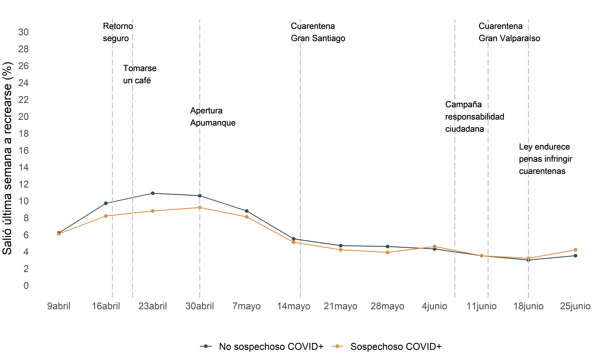
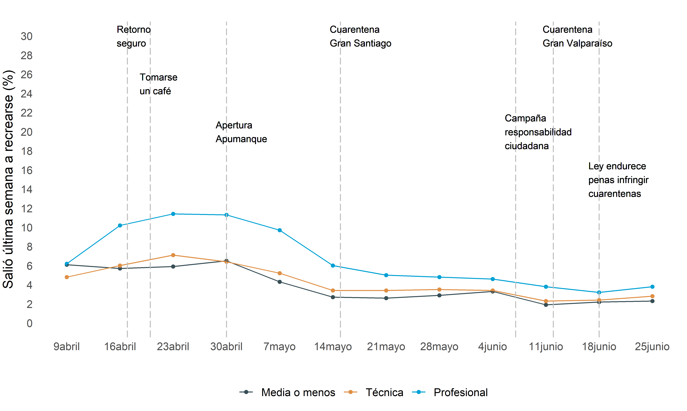
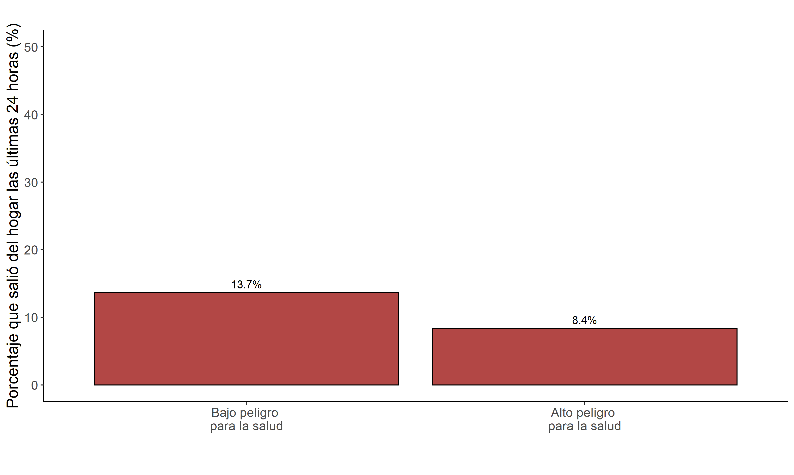
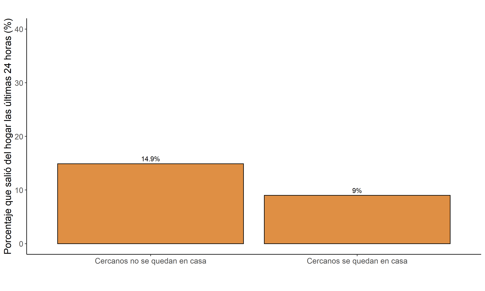
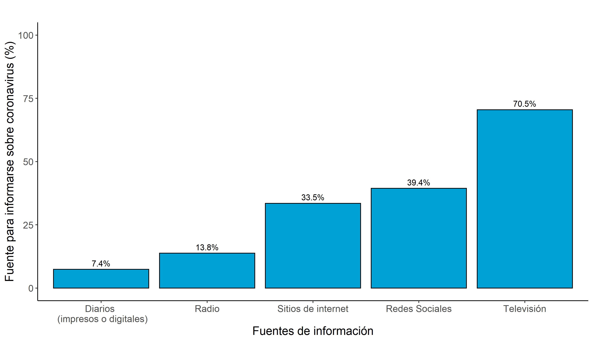

```{r setup, include=FALSE}
#Chunk options
knitr::opts_chunk$set(echo = TRUE, warning = FALSE, message= FALSE)
```


```{r, include=FALSE, message=FALSE, warning=FALSE}
# 1. Cargar librarias
pacman::p_load(haven,
               dplyr,
               kableExtra,
               knitr)
# 2, Cargar bases de datos

#Base MOVID
#movid <-read.csv("C:/Users/Valentina Andrade/Dropbox/MOVID-19/analisis/bases_anonimizadas/movid_20200713.csv",sep = ",",encoding = "UTF-8",stringsAsFactors = F, na.strings=c(""," ","NA"))
```


# Contexto
Hasta el día 6 de julio, en Chile hay 298.557 personas contagiadas por COVID-19 [(MINSAL, 2020)](https://www.minsal.cl/nuevo-coronavirus-2019-ncov/casos-confirmados-en-chile-covid-19/). Para avanzar en el control de la crisis sanitaria es fundamental **contar con una estrategia comunicacional clara, que incorpore adecuadamente las condiciones sanitarias y sociales de las personas y que tenga en cuenta las necesidades de las diversas audiencias**. La estrategia de comunicación debe servir varios propósitos: en primer lugar, debe mantener la alerta y la percepción de riesgo de manera de motivar la adherencia y mantención de comportamientos preventivos, con énfasis en las personas que, debido a sus condiciones sociales, deben seguir saliendo de sus hogares. En segundo lugar, es necesario considerar que, conforme aumenta el volumen de personas que adquieren el virus, se hace necesario entregar información respecto de cómo manejar la enfermedad y detener los contagios en el entorno cercano.

Este **séptimo informe MOVID-19 a la Mesa Social COVID-19** tiene por objetivo explorar la respuesta de la ciudadanía a distintos mensajes de las autoridades y proponer mejoras a la comunicación de riesgos durante la crisis sanitaria. Para ello, presentamos resultados en base a 52.077 participantes MOVID-19 recogidos a lo largo de doce semanas. Este informe es el resultado de una colaboración entre la Universidad de Chile y el Colegio Médico, con aportes de las Facultades de Psicología y de Comunicación y Letras de la Universidad Diego Portales, entre otras instituciones. A su vez, este informe se genera como una colaboración con el trabajo realizado por el Centro Microdatos (CMD), el Núcleo Milenio en Desarrollo Social (DESOC) y el Centro de Estudios de Conflicto y Cohesión Social (COES), presentando también resultados de la Encuesta Termómetro Social recogida entre el 30 de mayo y el 10 de junio 2020 (revisar más información en [este sitio web](https://www.microdatos.cl/termometro-social-junio)). 

# Salidas y mensajes de las autoridades 
**Los mensajes que las autoridades comunican a la ciudadanía son fundamentales para entender las decisiones que las personas toman respecto a salir de sus hogares**. Para analizar el efecto que los distintos mensajes han tenido en las salidas de las personas, nos enfocamos en el porcentaje de participantes MOVID-19 que cada semana reportan salir a recrearse. Salir a recrearse resulta un buen indicador de la influencia de los mensajes de autoridades dado que esta actividad se encuentra menos afectada por factores contextuales y estructurales como la necesidad de salir a trabajar o a visitar parientes con determinadas necesidades. Las Figuras 1 y 2 muestran cómo ha variado en el tiempo el porcentaje de personas que ha salido a recrearse a la luz de distintos mensajes de las autoridades. 
Primero, vemos que las salidas fueron mayores entre el 16 y el 30 de abril. **Este aumento en las salidas a recrearse se corresponde con el llamado a volver a una "nueva normalidad"**: el 17 de abril el gobierno publica el instructivo de “Retorno Seguro” para funcionarios públicos, el 20 de abril la Subsecretaria Daza indica que probablemente resulte posible juntarse a tomar un café con amigos y el 30 de abril el Alcalde de Las Condes, Joaquín Lavín, vuelve a abrir el Centro Comercial Apumanque al público.  Luego de esto, las salidas por recreación han ido disminuyendo de manera lenta y paulatina, a medida que el Gran Santiago y el Gran Valparaíso entraron en cuarentena. 
Estas tendencias se han observado tanto para personas con y sin síntomas de enfermedades compatibles con coronavirus (ver Figura 1): entre el 9 y el 23 de abril, por ejemplo, las personas no sospechosas de tener coronavirus aumentaron sus salidas a recreación en un 75,8%, mientras que las personas sospechosas de tener coronavirus las aumentaron en un 44,3%. **En el caso de las salidas de personas sospechosas de tener coronavirus, este aumento de salidas durante las semanas de la “nueva normalidad” es particularmente complejo dado que significó exponer de manera innecesaria a la ciudadanía**. Observando diferencias según nivel educacional de los participantes MOVID-19 queda en evidencia un aumento relevante en las salidas recreativas de personas con título profesional: entre el 9 y el 23 de abril las personas con título profesional aumentaron sus salidas a recrearse en un 83,9%. Esto último sugiere la necesidad de diseñar campañas orientadas a respetar la cuarentena y evitar salidas innecesarias enfocadas a esta población. 

<center>
```{r, out.width = "95%",echo=F, cache=T}

```
</center><font size="2"><p style="line-height: 1em;">*Figura 1*. Salidas a recrearse según si el participante es sospechoso de COVID-19 o no. Elaboración propia con Datos MOVID-19 (n = 52.077, 301.187 observaciones). 
</font></p>

<center>
```{r, out.width = "95%",echo=F, cache=T}

```
</center><font size="2"><p style="line-height: 1em;">*Figura 2*. Salidas a recrearse según nivel educacional. Elaboración propia con Datos MOVID-19 (n = 52.077, 301.187 observaciones).
</font></p>

# Salidas de casa, percepción de riesgo y normas sociales
¿Por qué son tan importantes los mensajes de las autoridades? Primero, porque dan indicaciones acerca de qué tanto riesgo supone el coronavirus para la salud de las personas. **La percepción de severidad de la amenaza es un factor relevante en la adopción de medidas preventivas y debe ser explicitada y reforzada en la estrategia comunicacional de las autoridades**. Según datos de la Encuesta Termómetro Social, un 73,7% de las personas considera que el COVID-19 es muy o extremadamente peligroso para la salud de las personas. Esta percepción de riesgo se vincula a la decisión de permanecer en casa: entre quienes perciben al coronavirus como teniendo un alto peligro  para la salud de las personas, 8,4% registra haber salido de su hogar durante las últimas 24 horas; este número  asciende al 13,7% cuando se considera a aquellos que perciben  en el coronavirus  un bajo peligro (ver Figura 3).  

<center>
```{r, out.width = "80%",echo=F, cache=T}

```
</center><font size="2"><p style="line-height: 1em;">*Figura 3.* Salidas según percepción de peligro del coronavirus. Elaboración propia en base a datos de Encuesta Termómetro Social (CMD, DESOC, COES) (n = 1078).
</font></p>

Las autoridades también comunican en sus mensajes lo que es esperado por parte de la ciudadanía o aquello que es socialmente aceptado. Así, para que las personas se queden en casa es fundamental que perciban que esto es lo que se espera de ellos como miembros de la sociedad [(Schultz et al., 2007)](https://journals.sagepub.com/doi/abs/10.1111/j.1467-9280.2007.01917.x). De esta forma, percibir que personas cercanas, como amigos y familiares, también se quedan en casa puede ser un importante aliciente para que las personas cumplan con esta recomendación. Según datos del Termómetro Social, el 83,9% de las personas reporta que la mayoría o todos sus cercanos han seguido la recomendación de quedarse en casa. Entre estas personas, solamente el 9% reporta haber salido durante las últimas 24 horas. Mientras tanto, este valor sube a un 14,9% de salidas entre quienes se rodean de personas que no cumplen con esta recomendación (ver Figura 4). Estos resultados sugieren que **es fundamental comunicar a la población que la expectativa es que todos se queden en casa** dentro de lo posible. A su vez, implica que **las autoridades deben partir por dar el ejemplo y no salir en circunstancias no esenciales**. Una conducta incongruente por parte de las autoridades puede hasta reducir el efecto positivo de campañas que promuevan el quedarse en casa y el distanciamiento social. Por último, se sugiere **comunicar ejemplos del gran número de personas que sí están reduciendo sus salidas al mínimo en vez de enfocarse en aquellas que se salen de la norma**. En este sentido, resulta importante reportar resultados como los encontrados en el Termómetro Social, según los cuales más del 90% de las personas reporta el cumplimiento de prácticas de cuidado como lavado de manos, uso de mascarilla y permancencia en el hogar.

<center>
```{r, out.width = "80%",echo=F, cache=T}

```
</center><font size="2"><p style="line-height: 1em;">*Figura 4.* Salidas de casa según comportamiento de cercanos. Elaboración propia en base a Encuesta Termómetro Social (CMD, DESOC, COES) (n = 1078). 
</font></p>


# Fuentes de comunicación sobre coronavirus
Por último, para poder diseñar campañas tendientes a promover medidas de cuidado en la población, resulta fundamental considerar las fuentes informativas que las personas utilizan para adquirir información acerca del coronavirus. Según datos del Termómetro Social, el 70,5% de las personas se informan sobre coronavirus a través de la televisión, seguidas de un 39,4% que lo hace por redes sociales y un 33,5% que lo hace a través de sitios de internet (ver Figura 5). **Estos resultados sugieren que campañas que quieran mejorar prácticas de cuidado en la población debieran hacerlo principalmente a través de la televisión**.

<center>
```{r, out.width = "80%",echo=F, cache=T}

```
</center><font size="2"><p style="line-height: 1em;">*Figura 5*. Fuentes de información para informarse sobre coronavirus. Elaboración propia en base a Encuesta Termómetro Social (CMD, DESOC, COES) (n = 1078). 
</font></p>

# Recomendaciones

- **Comunicación de riesgo.** La percepción de que el COVID-19 es una amenaza severa para la salud motiva en las personas la mantención de conductas preventivas como quedarse en la casa. En ese sentido, es importante evitar mensajes que pudieran dar una falsa sensación de seguridad. Aun cuando el número de casos se encuentra a la baja en la Región Metropolitana, es importante que las autoridades reiteren que la amenaza sigue presente. Esto, dado que existen brotes epidémicos activos en la mayor parte del país y la posibilidad de rebrotes masivos en lugares con brotes a la baja seguirá siendo muy alta durante un largo período. Se recomienda, además, enfatizar que cualquier mejoría en los indicadores se debe a que las personas están adhiriendo a las medidas preventivas y que es necesario que éstas se mantengan. Se sugiere considerar mensajes que reconozcan el esfuerzo hecho por los ciudadanos y ciudadanas y que a la vez sirvan como refuerzos para la mantención de la conducta. Por otra parte, para motivar comportamientos preventivos, la percepción de severidad debe ir de la mano de una percepción de susceptibilidad, entendida como la creencia de que la amenaza es algo cercano y que puede afectar al individuo y su entorno [(Jones et al., 2015)](https://www.tandfonline.com/doi/abs/10.1080/10410236.2013.873363). En esa línea, junto con mantener una alta percepción de severidad sería recomendable comunicar  que la amenaza del COVID-19 es un peligro cercano que afecta a personas de distintos grupos etarios y condiciones de salud.
- **Campañas a la población.** Durante la emergencia sanitaria los esfuerzos de comunicación directa con la ciudadanía han sido insuficientes. Se hacen necesarias campañas masivas que busquen reforzar comportamientos de cuidado a través de mensajes educativos y persuasivos. Es necesario tener en cuenta que en un contexto de desconfinamiento estas prácticas tendrán que ser parte de la rutina cotidiana de las personas [(Cheng, Lam & Leung, 2020)](https://www.thelancet.com/journals/lancet/article/PIIS0140-6736(20)30918-1/fulltext),
lo cual requerirá campañas que incentiven la adherencia a estos comportamientos y su correcta ejecución por un tiempo prolongado. Las campañas debieran estar orientadas al menos a dos propósitos: (1) satisfacer las necesidades informativas de las personas que contraen COVID-19 con el fin de ayudarlas en el manejo de la enfermedad (consulta precoz, reconocimiento de síntomas de gravedad) y minimizar las probabilidades de que contagien a personas de sus entornos cercanos (auto-aislamiento precoz y medidas de prevención al interior de hogar) y (2) reforzar la adopción y mantención de comportamientos preventivos entre la población general, con énfasis en aquellas personas que debido a sus condiciones laborales no pueden permanecer en sus casas. Con respecto a este segundo propósito, es necesario insistir no solo en el cumplimiento de las medidas (ej. llevar mascarilla), sino en su adecuada ejecución (ej. llevar mascarilla bien puesta y no tocarla con las manos sucias). 
Las campañas deben llegar a grandes volúmenes de personas y asegurar una alta y reiterada exposición a los mensajes [(Wakefield et al., 2010)](http://www.sciencedirect.com/science/article/abs/pii/S0140673610608094). En ese sentido, la estrategia de diseminación de los mensajes de campaña debe tener como eje central a los medios de comunicación masivos, en especial la televisión, considerando que más de un 70% de las personas dice informarse acerca de la pandemia a través de dicho medio. Se podría explorar una alianza con los canales de televisión de manera que éstos donen tiempo en pantalla para transmitir los mensajes de la campaña. Además, las campañas deben desplegarse en el territorio, en especial en las área con mayor incidencia, donde los mensajes deben posicionarse en lugares de alta afluencia de público (medios de transporte, supermercados, ferias libres y otros comercios). 
- **Comunicación política.** La comunicación de parte de las autoridades debe ser clara y transparente para ser efectiva en informar y motivar cambios conductuales [(OMS, 2020)](https://www.who.int/publications/i/item/risk-communication-and-community-engagement-readiness-and-initial-response-for-novel-coronaviruses-(-ncov)). Los bajos niveles de confianza en las autoridades en estos momentos críticos, sin embargo, pueden atentar contra la efectividad de los mensajes [(Tirkkonen, & Luoma-aho, 2011)](https://www.sciencedirect.com/science/article/abs/pii/S0363811111000051). Considerando que la crisis del COVID-19 será de largo aliento, las autoridades deben trabajar en recuperar la confianza de la ciudadanía a través de una comunicación transparente y de la mantención de un comportamiento en línea con las recomendaciones vigentes para prevenir el avance de la pandemia. En lo inmediato, y teniendo en cuenta que la confianza en las fuentes de información es fundamental para que los mensajes prescriptivos de conductas preventivas surtan efecto, se recomienda priorizar en esos esfuerzos a otras fuentes que gocen de más credibilidad entre la ciudadanía, como por ejemplo, miembros de la comunidad médica y alcaldes. La diversificación de fuentes puede tener un mayor impacto en la población [(Tankard & Paluck, 2016)](https://psycnet.apa.org/record/2016-00592-007).


# Sobre MOVID-19
El Monitoreo Nacional de Síntomas y Prácticas COVID-19 en Chile (MOVID-19) es un esfuerzo colaborativo entre la Universidad de Chile, el Colegio Médico de Chile y otras instituciones académicas tales como la Universidad Diego Portales, la Pontificia Universidad Católica de Chile, la Universidad San Sebastián y la Universidad Central, en el que participan académicos de diversas disciplinas aportando sus saberes para responder de manera dinámica e innovadora a los desafíos que nos plantea la necesidad de generar conocimiento al ritmo en que se desarrolla una pandemia. A la fecha han participado 52.077 personas con al menos dos respuestas en el tiempo durante las últimas doce semanas, con participantes de 326 comunas del país.

Para saber más sobre MOVID-19 y la metodología del estudio, acceda a [www.movid19.cl](http://www.movid19.cl)
