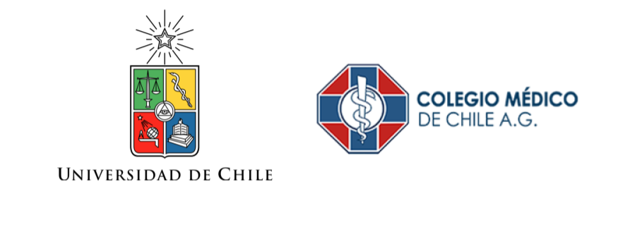

+++
# Blank widget.
widget = "blank" 
headless = true  
active = true  
weight = 1  

title = "Instituciones"

[design]

columns = "1"
  
+++

MOVID es una iniciativa que cuenta con el apoyo y patrocinio del [Colegio Médico de Chile](http://www.colegiomedico.cl/) y diversas instituciones educacionales, entre ellas la [Universidad de Chile](https://www.uchile.cl/) como institución responsable y la [Facultad de Psicología de la Universidad Diego Portales](https://psicologia.udp.cl/) como institución asociada. 

## Instituciones responsables

 

## Instituciones asociadas

