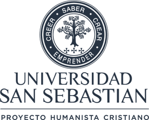

+++
# Blank widget.
widget = "blank"
headless = true  
active = true  
weight = 1  

title = "Instituciones"

[design]

columns = "1"

+++

MOVID-19 es una iniciativa que cuenta con el apoyo y patrocinio del [Colegio Médico de Chile](http://www.colegiomedico.cl/) y diversas instituciones educacionales, entre ellas la [Universidad de Chile](https://www.uchile.cl/) como institución responsable.

## Instituciones responsables
 

  

    

      <ul class="network-icon" aria-hidden="true">
      <li>
      <a href=https://www.uchile.cl/ class="big-icon"></i></a>
      </li>
      </ul>
    

    

      <ul class="network-icon" aria-hidden="true">
      <li>
       
      <a href="http://www.colegiomedico.cl/" class="big-icon"></i></a>
      </li>
      </ul>
    

  

## Instituciones asociadas
 

  

    

      <ul class="network-icon" aria-hidden="true">
      <li>
       
      <a href="https://psicologia.udp.cl/" class="big-icon"></i></a>
      </li>
      </ul>
    

    

      <ul class="network-icon" aria-hidden="true">
      <li>
      <a href="https://www.ucentral.cl/" class="big-icon"></i></a>
      </li>
      </ul>
    

    

      <ul class="network-icon" aria-hidden="true">
      <li>
      <a href="https://www.uss.cl/" class="big-icon"></i></a>
      </li>
      </ul>
    

    

      <ul class="network-icon" aria-hidden="true">
      <li>
      <a href="https://www.ufro.cl/" class="big-icon"></i></a>
      </li>
      </ul>
    

## Financiamiento

MOVID-19 cuenta con financiamiento del Colegio Médico de Chile, la Universidad de Chile, la Facultad de Psicología de la Universidad Diego Portales y de la Agencia Nacional de Investigación y Desarrollo (ANID) bajo la adjudicación del proyecto N° COVID0960 titulado **“Impacto del COVID-19 en Chile: una evaluación transdisciplinaria de la respuesta a la pandemia y sus consecuencias"**

 
 

  

    

      <ul class="network-icon" aria-hidden="true">
      <li>
       
      <a href="http://www.colegiomedico.cl/" class="big-icon"></i></a>
      </li>
      </ul>
    

    

      <ul class="network-icon" aria-hidden="true">
      <li>
      <a href="https://www.uchile.cl/" class="big-icon"></i></a>
      </li>
      </ul>
    

    

      <ul class="network-icon" aria-hidden="true">
      <li>
      <a href="https://www.udp.cl/" class="big-icon"></i></a>
      </li>
      </ul>
    

    

      <ul class="network-icon" aria-hidden="true">
      <li>
      <a href="https://www.anid.cl/" class="big-icon"></i></a>
      </li>
      </ul>
    

